```mermaid
sequenceDiagram
    participant User
    participant Web as Web App
    participant Backend as Backend<br/>(Socket.io Relay)
    participant Mobile as Mobile App
    participant Crypto as Crypto Module

    Note over User,Crypto: Prerequisites: Mobile & Web Connected

    User->>Web: Enter message text<br/>Click "Sign Message"
    activate Web
    Web->>Web: Generate requestId<br/>(sign-{timestamp})
    Web->>Web: Check mobileSignature exists
    Web->>Web: Set pendingRequest state
    Web->>Backend: emit('web:signMessage',<br/>{ requestId, message,<br/>  mobileSignature })
    deactivate Web

    activate Backend
    Backend->>Backend: Find session by web socketId
    Backend->>Backend: Verify mobileSignature matches session
    Backend->>Backend: Verify permissionGranted = true
    Backend->>Backend: Get mobile socketId
    Backend->>Backend: Sign request with signingKey
    Backend->>Mobile: emit('mobile:signRequest',<br/>{ requestId, type, message,<br/>  timestamp, sessionId,<br/>  requestSignature,<br/>  mobileSignature })
    deactivate Backend

    activate Mobile
    Mobile->>Mobile: Receive signRequest event
    Mobile->>Mobile: Verify sessionId matches
    Mobile->>Mobile: Verify timestamp (max 5 min)
    Mobile->>Mobile: Verify mobileSignature matches
    Mobile->>Mobile: Verify requestSignature (from backend)
    Mobile->>Mobile: Set pendingRequest state
    Mobile->>Mobile: Show approval modal<br/>Display: message content
    deactivate Mobile

    Note over User,Mobile: User Reviews Request

    User->>Mobile: Click "Approve" ✅
    activate Mobile
    Mobile->>Mobile: Call handleApprove()
    Mobile->>Crypto: digestStringAsync(SHA256,<br/>`${message}-${address}-${timestamp}`)
    activate Crypto
    Crypto-->>Mobile: hash
    deactivate Crypto
    Mobile->>Mobile: signature = `0x${hash}`
    Mobile->>Mobile: result = { signature, message }

    Mobile->>Backend: emit('mobile:response',<br/>{ requestId, type, approved: true, result })
    activate Backend
    Mobile->>Mobile: Clear pendingRequest
    Mobile->>Mobile: Show "Success" alert
    deactivate Mobile

    Backend->>Backend: Find session by mobile socketId
    Backend->>Backend: Get web socketId
    Backend->>Web: emit('web:response',<br/>{ requestId, approved, result, type })
    deactivate Backend

    activate Web
    Web->>Web: Receive response event
    Web->>Web: Clear pendingRequest
    Web->>Web: Set response state
    Web->>Web: Display signature in UI<br/>{ signature: '0x...', message }
    deactivate Web

    Note over User,Crypto: ✅ Message Signed Successfully

    Note over User,Crypto: Alternative: User Rejects

    User->>Mobile: Click "Reject" ❌
    activate Mobile
    Mobile->>Mobile: Call handleReject()
    Mobile->>Backend: emit('mobile:response',<br/>{ requestId, type, approved: false,<br/>result: { reason: 'User rejected' } })
    activate Backend
    Mobile->>Mobile: Clear pendingRequest
    Mobile->>Mobile: Show "Rejected" alert
    deactivate Mobile

    Backend->>Web: emit('web:response',<br/>{ requestId, approved: false, result })
    deactivate Backend

    activate Web
    Web->>Web: Display rejection message
    deactivate Web

    Note over User,Crypto: ❌ Request Rejected
```

# 🔄 WalletConnect Demo - Sequence Diagrams

Comprehensive flow diagrams for all interactions in the WalletConnect demo system.

## Table of Contents

1. [Connection Flow](#1-connection-flow)
2. [Sign Message Flow](#2-sign-message-flow)
3. [Send Transaction Flow](#3-send-transaction-flow)
4. [Disconnect Flow](#4-disconnect-flow)
5. [Error Handling Flows](#5-error-handling-flows)

---

## 1. Connection Flow

### Overview
User connects mobile wallet to web app by scanning QR code. This flow includes the 3-step authentication process where mobile generates permission signature immediately after scanning QR code (following WalletConnect v2.0 pattern).

### Mermaid Diagram


### Step-by-Step Breakdown

1. **Web App Creates Session**
   - User clicks "Connect Wallet"
   - Web calls `POST /api/create-session`
   - Backend generates UUID and stores session
   - Returns sessionId to web

2. **Web App Joins Session**
   - Web creates Socket.io connection
   - Emits `web:join` with sessionId
   - Backend stores web's socketId
   - Web displays QR code

3. **Mobile Scans QR**
   - User opens mobile app
   - Clicks "Scan QR Code"
   - Camera opens and scans QR
   - Parses sessionId and serverUrl

4. **Mobile Generates Signature and Joins Session** (Following WalletConnect v2.0 Pattern)
   - Mobile generates permission signature IMMEDIATELY after parsing QR:
     - Creates signature: `SHA256(sessionId + walletAddress + timestamp)`
     - Stores signature for later use
   - Mobile connects to backend via Socket.io
   - Mobile emits `mobile:join` WITH signature:
     - Includes `sessionId`, `walletAddress`, `signature`, `timestamp`
   - Backend verifies immediately:
     - Session exists
     - No other mobile already connected (prevent takeover)
     - Signature format is valid
     - Wallet address format is valid
     - Timestamp is within 5 minutes
   - Backend stores in session:
     - `mobileSignature`
     - `mobileWalletAddress`
     - `permissionGranted: true`
     - `status: 'connected'`

5. **Connection & Authentication Complete**
   - Backend notifies mobile: `mobile:joined` with `authenticated: true`
   - Backend notifies web: `mobile:connected` with signature
   - Both sides store mobile signature
   - Ready for authenticated blockchain operations

---

## 2. Sign Message Flow

### Overview
Web app requests mobile wallet to sign a message, user approves/rejects.

### Mermaid Diagram



### Step-by-Step Breakdown

#### Approval Path

1. **Web Initiates Request**
   - User enters message text
   - Clicks "Sign Message" button
   - Web checks if mobileSignature exists
   - Web generates unique requestId
   - Emits `web:signMessage` with mobileSignature to backend

2. **Backend Verifies and Relays Request**
   - Finds session using web's socketId
   - Verifies mobileSignature matches session
   - Verifies permissionGranted = true
   - Gets mobile's socketId from session
   - Signs request with signingKey (HMAC)
   - Emits `mobile:signRequest` with signatures to mobile

3. **Mobile Verifies Request**
   - Verifies sessionId matches own session
   - Verifies timestamp (prevents replay)
   - Verifies mobileSignature matches own signature
   - Verifies requestSignature (from backend)
   - Only then accepts request

4. **Mobile Shows Approval UI**
   - Receives `mobile:signRequest` event
   - Updates pendingRequest state
   - Displays modal with message content
   - Shows "Approve" and "Reject" buttons

5. **User Approves**
   - Clicks "Approve" button
   - Mobile calls `mockSignMessage()`
   - Generates SHA256 hash as signature
   - Creates result object

6. **Mobile Sends Response**
   - Emits `mobile:response` with approved=true
   - Includes signature in result
   - Clears modal
   - Shows success alert

7. **Web Receives Response**
   - Backend relays response to web
   - Web displays signature
   - Shows formatted response

#### Rejection Path

- User clicks "Reject"
- Mobile sends response with approved=false
- Web shows rejection message
- No signature generated

---

## 3. Send Transaction Flow

### Overview
Web app requests mobile wallet to send a transaction, user reviews and approves/rejects.

### Mermaid Diagram


### Step-by-Step Breakdown

#### Approval Path

1. **Web Initiates Transaction**
   - User enters transaction details
   - Clicks "Send Transaction"
   - Web validates transaction data
   - Web checks if mobileSignature exists
   - Web generates unique requestId
   - Emits `web:sendTransaction` with mobileSignature

2. **Backend Validates and Relays Request**
   - Finds session by web's socketId
   - Verifies mobileSignature matches session
   - Verifies permissionGranted = true
   - Validates request size (max 10KB)
   - Checks rate limiting (30 req/min)
   - Checks replay protection (requestId)
   - Sanitizes transaction data
   - Validates transaction fields
   - Signs request with signingKey
   - Gets mobile's socketId
   - Emits `mobile:transactionRequest` with signatures

3. **Mobile Verifies Request**
   - Verifies sessionId matches own session
   - Verifies timestamp (prevents replay)
   - Verifies mobileSignature matches own signature
   - Verifies requestSignature (from backend)
   - Only then accepts request

4. **Mobile Shows Transaction Details**
   - Receives `mobile:transactionRequest`
   - Updates pendingRequest state
   - Displays modal with:
     - From: wallet address
     - To: recipient address
     - Amount: X ETH
   - Shows "Approve" and "Reject" buttons

5. **User Reviews & Approves**
   - Reviews transaction details
   - Clicks "Approve"
   - Mobile calls `mockSendTransaction()`
   - Generates SHA256 hash as txHash

5. **Mobile Sends Response**
   - Emits `mobile:response` with approved=true
   - Includes txHash, to, amount, from
   - Clears modal
   - Shows success alert

7. **Web Receives Confirmation**
   - Backend relays response
   - Web displays transaction hash
   - Shows complete transaction details

#### Rejection Path

- User reviews details
- Clicks "Reject"
- Mobile sends response with approved=false
- Web shows rejection message
- No transaction hash generated

---

## 4. Disconnect Flow

### Overview
User disconnects mobile wallet from web app.

### Mermaid Diagram


### Step-by-Step Breakdown

#### Mobile Initiates Disconnect

1. User clicks "Disconnect" on mobile
2. Mobile closes socket connection
3. Mobile clears all state
4. Backend detects disconnect
5. Backend notifies web
6. Web updates UI to show disconnected

#### Web Initiates Disconnect

1. User closes tab or clicks reset
2. Web clears state
3. Web closes socket
4. Backend detects disconnect
5. Mobile not notified (will detect on next action)

#### Network Disconnect

1. Network connection lost
2. Both clients timeout
3. Backend detects both disconnects
4. Session marked as disconnected
5. Scheduled for cleanup

---

## 5. Error Handling Flows

### Overview
Various error scenarios and how the system handles them.

### Mermaid Diagram


### Error Scenarios Summary

1. **Invalid QR Code**
   - User scans malformed QR
   - JSON parse fails
   - Alert shown, stays in scanner

2. **Invalid Session ID**
   - Session doesn't exist in backend
   - Backend emits error
   - Mobile shows alert

3. **Mobile Not Connected**
   - Web sends request but no mobile
   - Backend checks mobile socketId
   - Returns error to web

4. **Request Timeout**
   - User doesn't respond
   - Optional timeout implemented
   - Request auto-cancelled

5. **Camera Permission Denied**
   - User denies camera access
   - Scanner can't open
   - Alert shown with instructions

6. **Network Connection Lost**
   - Socket disconnects
   - Both clients detect
   - UI updates to show disconnected

7. **Backend Server Down**
   - Connection attempts fail
   - Retry logic exhausted
   - Clear error message shown

8. **Crypto Operation Fails**
   - Hash generation error
   - Error caught and handled
   - User can retry

---

## Complete System Flow Diagram

### High-Level Overview


---

## Architecture Overview


---

## Data Flow Summary

### Session Data Structure

```typescript
{
  sessionId: "uuid-v4",
  webSocketId: "socket-id-1",
  mobileSocketId: "socket-id-2",
  status: "connected", // pending | permission_pending | connected | disconnected
  createdAt: 1234567890,
  signingKey: "hex-string", // Backend signing key for requests
  mobileSignature: "0x...", // Mobile's permission signature (Step 2)
  mobileWalletAddress: "0x...", // Mobile wallet address
  permissionGranted: true // Whether mobile granted permission
}
```

### Request Data Structure

```typescript
// Sign Message Request (from Web to Backend)
{
  requestId: "sign-1699234567890",
  type: "signMessage",
  message: "Hello World",
  mobileSignature: "0x..." // Required: Mobile's permission signature
}

// Sign Message Request (from Backend to Mobile)
{
  requestId: "sign-1699234567890",
  type: "signMessage",
  message: "Hello World",
  timestamp: 1699234567890,
  sessionId: "uuid-v4", // For mobile verification
  requestSignature: "hex-string", // Backend signature (HMAC)
  mobileSignature: "0x..." // Mobile signature for reference
}

// Transaction Request (from Web to Backend)
{
  requestId: "tx-1699234567890",
  transactionType: "nativeTransfer",
  to: "0x742d35Cc6634C0532925a3b844Bc9e7595f0bEb0",
  amount: "0.1",
  value: "100000000000000000", // Wei
  chainId: "1",
  mobileSignature: "0x..." // Required: Mobile's permission signature
  // ... other transaction fields
}

// Transaction Request (from Backend to Mobile)
{
  requestId: "tx-1699234567890",
  transactionType: "nativeTransfer",
  to: "0x742d35Cc6634C0532925a3b844Bc9e7595f0bEb0",
  amount: "0.1",
  value: "100000000000000000",
  timestamp: 1699234567890,
  sessionId: "uuid-v4", // For mobile verification
  requestSignature: "hex-string", // Backend signature (HMAC)
  mobileSignature: "0x..." // Mobile signature for reference
}
```

### Response Data Structure

```typescript
// Approved Response
{
  requestId: "sign-1699234567890",
  type: "signMessage",
  approved: true,
  result: {
    signature: "0xabc123...",
    message: "Hello World"
  }
}

// Rejected Response
{
  requestId: "sign-1699234567890",
  type: "signMessage",
  approved: false,
  result: {
    reason: "User rejected"
  }
}
```

---

## Timing Considerations

### Connection Establishment
- **Session Creation**: ~50ms (Backend UUID generation)
- **QR Display**: ~100ms (QR code rendering)
- **Socket Connection**: ~200-500ms (Network latency)
- **Total Connection Time**: ~1-2 seconds

### Request Processing
- **Request Relay**: ~50-100ms (Backend relay)
- **User Review**: Variable (user dependent)
- **Crypto Operation**: ~10-50ms (SHA256 hash)
- **Response Relay**: ~50-100ms (Backend relay)
- **Total Round Trip**: ~100-300ms (excluding user review)

### Cleanup
- **Disconnect Detection**: ~1-5 seconds (Socket timeout)
- **Session Cleanup**: 10 minutes interval check
- **Session Expiration**: 1 hour (configurable)

---

## Security Flow (Enhanced with 3-Step Handshake)

```mermaid
sequenceDiagram
    participant Web
    participant Backend
    participant Mobile

    Note over Web,Mobile: Enhanced Security with 3-Step Handshake

    Note over Web,Mobile: Step 1: Session Creation
    Web->>Backend: POST /api/create-session
    Backend->>Backend: Generate sessionId + signingKey
    Backend-->>Web: { sessionId, signingKey }

    Note over Web,Mobile: Step 2: Permission & Authentication
    Mobile->>Backend: Socket.io connect
    Mobile->>Backend: emit('mobile:join', { sessionId })
    Backend->>Backend: Prevent session takeover
    Backend-->>Mobile: emit('mobile:joined')
    Mobile->>Mobile: Show permission popup
    Mobile->>Mobile: Generate permission signature<br/>(sessionId + walletAddress)
    Mobile->>Backend: emit('mobile:permission', { signature })
    Backend->>Backend: Verify signature
    Backend->>Backend: Store mobileSignature
    Backend-->>Mobile: emit('mobile:permissionAccepted')
    Backend-->>Web: emit('mobile:connected', { mobileSignature })

    Note over Web,Mobile: Step 3: Authenticated Requests
    Web->>Backend: Request + mobileSignature
    Backend->>Backend: Verify mobileSignature
    Backend->>Backend: Sign request with signingKey
    Backend->>Mobile: Request + requestSignature + mobileSignature
    Mobile->>Mobile: Verify all signatures
    Mobile->>Mobile: Verify sessionId
    Mobile->>Mobile: Verify timestamp
    Mobile->>Backend: Response
    Backend->>Web: Response

    Note over Web,Mobile: Security Features Implemented:<br/>✅ Session takeover prevention<br/>✅ Permission signature verification<br/>✅ Mobile signature in all requests<br/>✅ Backend request signing<br/>✅ Mobile request verification<br/>✅ Replay protection<br/>✅ Rate limiting<br/>✅ Request sanitization<br/>⚠️ Still using mock signatures<br/>⚠️ WSS recommended for production<br/>⚠️ Real private key signing needed
```



---

**Note**: These diagrams represent the current demo implementation. For production use, additional security measures, error handling, and validation would be required.

---

**Generated**: 2024-11-04
**Project**: WalletConnect Demo
**Version**: 1.0.0
