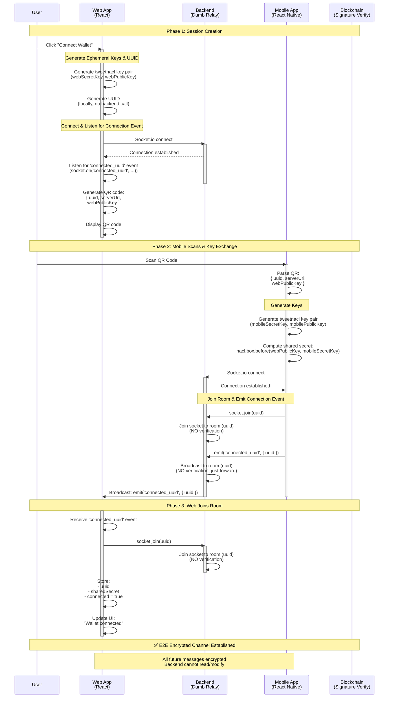

# Connection Flow - E2E Encrypted (Improved)

## Overview
Zero-trust backend architecture where Web and Mobile establish end-to-end encryption. Backend only forwards encrypted messages without reading content.

## Security Mechanisms

### 1. Key Exchange (TweetNaCl - Curve25519)
- Web generates ephemeral key pair using `nacl.box.keyPair()` (webSecretKey, webPublicKey)
- Mobile generates ephemeral key pair using `nacl.box.keyPair()` (mobileSecretKey, mobilePublicKey)
- Shared secret = `nacl.box.before(peerPublicKey, mySecretKey)`
- Used for `nacl.box` encryption (authenticated encryption)

### 2. Connection Establishment
- Web generates UUID and listens for connection
- Mobile connects, joins room, and emits connection event
- Web joins room when connection event received

---

## Mermaid Diagram



---

## Step-by-Step Breakdown

### Phase 1: Web Generates UUID and QR Code

1. **Web generates ephemeral keys using tweetnacl**
   ```js
   const nacl = require('tweetnacl');
   const webKeyPair = nacl.box.keyPair();
   // webKeyPair.publicKey: Uint8Array (32 bytes)
   // webKeyPair.secretKey: Uint8Array (32 bytes)
   ```

2. **Web generates UUID locally**
   ```js
   const { randomUUID } = require('crypto'); // Node.js
   // or
   const { v4: uuidv4 } = require('uuid'); // Browser
   // or
   const uuid = crypto.randomUUID(); // Web Crypto API (browser)
   
   const uuid = randomUUID(); // e.g., "550e8400-e29b-41d4-a716-446655440000"
   ```

3. **Web connects and listens for connection event**
   ```js
   const socket = io(serverUrl);
   
   socket.on('connect', () => {
     // Listen for 'connected_uuid' event
     socket.on('connected_uuid', (data) => {
       const { uuid } = data;
       // Join the room when mobile connects
       socket.join(uuid);
       console.log('Joined room:', uuid);
     });
   });
   ```

4. **QR Code contains**
   ```json
   {
     "uuid": "550e8400-e29b-41d4-a716-446655440000",
     "serverUrl": "wss://...",
     "webPublicKey": "base64encoded..."
   }
   ```

### Phase 2: Mobile Scans and Generates Keys

1. **Mobile parses QR**
   ```js
   const { uuid, webPublicKey } = parseQR();
   const webPublicKeyBytes = Buffer.from(webPublicKey, 'base64');
   ```

2. **Mobile generates key pair using tweetnacl**
   ```js
   const nacl = require('tweetnacl');
   const mobileKeyPair = nacl.box.keyPair();
   // mobileKeyPair.publicKey: Uint8Array (32 bytes)
   // mobileKeyPair.secretKey: Uint8Array (32 bytes)
   ```

3. **Mobile computes shared secret**
   ```js
   const sharedSecret = nacl.box.before(webPublicKeyBytes, mobileKeyPair.secretKey);
   // sharedSecret: Uint8Array (32 bytes)
   ```

### Phase 3: Mobile Connects and Joins Room

1. **Mobile connects, joins room, and emits connection event**
   ```js
   const socket = io(serverUrl);
   
   socket.on('connect', () => {
     // Join room with UUID
     socket.join(uuid);
     
     // Emit connection event to notify Web
     socket.emit('connected_uuid', { uuid });
   });
   ```

### Phase 4: Backend Room Management (WITHOUT decrypting)

```js
// Backend code - DUMB RELAY with Socket.io Rooms

io.on('connection', (socket) => {
  // Mobile joins room and emits connection event
  socket.on('connected_uuid', (data) => {
    const { uuid } = data;
    
    // Backend CANNOT and SHOULD NOT verify anything
    // Just broadcast to all sockets in the room (including Web)
    io.to(uuid).emit('connected_uuid', { uuid });
  });
  
  // Handle disconnections (Socket.io automatically removes from rooms)
  socket.on('disconnect', () => {
    // No cleanup needed - Socket.io handles room cleanup
  });
  
  // Forward any future messages through rooms
  socket.on('message', (data) => {
    const { uuid } = data;
    // Forward to other participants in the room
    socket.to(uuid).emit('message', data);
  });
});
```

### Phase 5: Web Joins Room

1. **Web receives connection event and joins room**
   ```js
   socket.on('connected_uuid', (data) => {
     const { uuid } = data;
     
     // Join the room
     socket.join(uuid);
     
     // Store connection info
     setConnection({
       uuid,
       connected: true,
       sharedSecret: sharedSecret // computed earlier from webPublicKey
     });
     
     console.log('Connected to room:', uuid);
   });
   ```

---

## Security Benefits

### ✅ Zero-Trust Backend
- Backend cannot read message contents
- Backend cannot forge signatures
- Backend cannot fake authentication
- Compromised backend ≠ compromised security

### ✅ Direct Connection
- Mobile connects and joins room directly
- Web joins room when connection event received
- Simple room-based communication

### ✅ Forward Secrecy
- Ephemeral keys rotated per session
- Old sessions cannot be decrypted if keys compromised

### ✅ Message Integrity
- nacl.box provides authenticated encryption (MAC included)
- Replay protection via timestamp and nonce
- Man-in-the-middle detection

---

## Attack Resistance

| Attack Vector | Protection |
|--------------|-----------|
| Backend compromise | E2E encryption, backend can't read |
| Man-in-the-middle | TweetNaCl Curve25519 key exchange |
| Replay attack | Timestamp + nonce checking |
| Session hijacking | Room-based isolation |

---

## Backend Responsibilities (Minimal)

```js
// Backend ONLY does:
1. Handle socket connections
2. Manage Socket.io rooms (join/leave)
3. Broadcast events to room participants
4. Handle disconnections (auto-cleanup by Socket.io)
5. Rate limiting (optional)

// Backend NEVER does:
❌ Generate or validate UUID
❌ Verify signatures
❌ Decrypt messages
❌ Store authentication state
❌ Validate wallet addresses
❌ Check permissions
```

---

## Implementation Notes

### Key Management
```js
// Web side
const connection = {
  uuid: string, // UUID generated locally, used as room identifier
  webKeyPair: { publicKey: Uint8Array, secretKey: Uint8Array },
  sharedSecret: Uint8Array,
  connected: boolean
};

// Mobile side
const session = {
  uuid: string, // Extracted from QR code, used as room identifier
  mobileKeyPair: { publicKey: Uint8Array, secretKey: Uint8Array },
  webPublicKey: Uint8Array,
  sharedSecret: Uint8Array,
  connected: boolean
};
```

### Message Format (All future communications)
```js
{
  uuid: string,             // UUID room identifier
  encryptedPayload: string, // base64
  nonce: string,            // base64 (24 bytes for nacl.box)
  timestamp: number
}
```

### Encryption Helper
```js
const nacl = require('tweetnacl');

function encryptMessage(message, peerPublicKey, mySecretKey) {
  const nonce = nacl.randomBytes(24);
  const encoded = new TextEncoder().encode(JSON.stringify(message));
  
  const encrypted = nacl.box(encoded, nonce, peerPublicKey, mySecretKey);
  
  return {
    encrypted: Buffer.from(encrypted).toString('base64'),
    nonce: Buffer.from(nonce).toString('base64')
  };
}

function decryptMessage(encryptedBase64, nonceBase64, peerPublicKey, mySecretKey) {
  const encrypted = Buffer.from(encryptedBase64, 'base64');
  const nonce = Buffer.from(nonceBase64, 'base64');
  
  const decrypted = nacl.box.open(encrypted, nonce, peerPublicKey, mySecretKey);
  
  if (!decrypted) {
    throw new Error('Decryption failed');
  }
  
  return JSON.parse(new TextDecoder().decode(decrypted));
}
```

---

## Comparison: Old vs New

| Aspect | Old Flow | New Flow |
|--------|----------|----------|
| Backend trust | Required | Zero-trust |
| Encryption | None | E2E TweetNaCl box (Curve25519) |
| Auth method | SHA256 hash | ECDSA signature |
| Verification | Backend | Web (client) |
| Compromise impact | High | Low |
| Signature strength | Weak | Cryptographic |
| Message auth | HMAC | Built-in MAC (nacl.box) |