# Connection Flow - Phoenix Protocol SDK

## Overview
Zero-trust backend architecture where dApp and Wallet establish end-to-end encryption using the Phoenix Protocol SDK. The backend only forwards encrypted messages without reading content. The SDK handles all encryption, key management, and session persistence automatically.

## Security Mechanisms

### 1. Key Exchange (TweetNaCl - Curve25519)
- dApp SDK generates ephemeral key pair using `nacl.box.keyPair()` (dappSecretKey, dappPublicKey)
- Wallet SDK generates ephemeral key pair using `nacl.box.keyPair()` (walletSecretKey, walletPublicKey)
- Shared secret = `nacl.box.before(peerPublicKey, mySecretKey)`
- Used for `nacl.box` encryption (authenticated encryption with built-in MAC)

### 2. Connection Establishment
- dApp SDK generates UUID and connection URI
- Wallet SDK scans QR code and parses connection data
- Both parties join Socket.io room and exchange public keys
- Session persistence allows automatic reconnection after page reload/app restart

---

## Mermaid Diagram - SDK Flow

```mermaid
sequenceDiagram
    participant User
    participant DAppSDK as PhoenixDappClient<br/>(@phoenix-demo/dapp)
    participant Storage as SessionStorage<br/>(localStorage/AsyncStorage)
    participant Backend as Backend<br/>(Dumb Relay)
    participant WalletSDK as PhoenixWalletClient<br/>(@phoenix-demo/wallet)

    Note over User,WalletSDK: Phase 1: Initial Connection

    User->>DAppSDK: client.connect()
    activate DAppSDK
    DAppSDK->>DAppSDK: EncryptionManager generates key pair<br/>(dappSecretKey, dappPublicKey)
    DAppSDK->>DAppSDK: Generate UUID: crypto.randomUUID()
    DAppSDK->>DAppSDK: URIEncoder.encodeURI({<br/>  version, uuid, serverUrl,<br/>  publicKey<br/>})<br/>→ "phoenix:{JSON}"
    DAppSDK->>DAppSDK: Initialize session: { uuid, connected: false }
    DAppSDK->>Storage: SessionStorage.saveSession()<br/>→ Save initial session (before wallet connects)
    DAppSDK->>DAppSDK: connectSocket(uuid)
    DAppSDK->>Backend: Socket.io connect
    activate Backend
    Backend-->>DAppSDK: Connection established
    DAppSDK->>Backend: socket.emit('join', { uuid })
    Backend->>Backend: Join socket to room (uuid)
    DAppSDK->>DAppSDK: Listen for 'connected_uuid' event
    deactivate Backend
    DAppSDK-->>User: Return { uri, uuid }<br/>→ Display QR code
    deactivate DAppSDK

    Note over User,WalletSDK: Phase 2: Wallet Scans & Connects

    User->>WalletSDK: Scan QR code → client.connect(qrData, signer)
    activate WalletSDK
    WalletSDK->>WalletSDK: QRParser.parseURI(qrData)<br/>→ Extract { version, uuid, serverUrl, publicKey }
    WalletSDK->>WalletSDK: EncryptionManager generates key pair<br/>(walletSecretKey, walletPublicKey)
    WalletSDK->>WalletSDK: EncryptionManager.setPeerPublicKey(dappPublicKey)<br/>→ Compute shared secret
    WalletSDK->>WalletSDK: RequestHandler.setSigner(signer)
    WalletSDK->>WalletSDK: Initialize session: { uuid, connected: false, address, chainType }
    WalletSDK->>Storage: SessionStorage.saveSession()<br/>→ Save session with keys
    WalletSDK->>WalletSDK: connectSocket(serverUrl, uuid)
    WalletSDK->>Backend: Socket.io connect
    activate Backend
    Backend-->>WalletSDK: Connection established
    WalletSDK->>Backend: socket.emit('join', { uuid })
    Backend->>Backend: Join socket to room (uuid)
    WalletSDK->>Backend: socket.emit('connected_uuid', {<br/>  uuid,<br/>  publicKey: walletPublicKey<br/>})
    Backend->>Backend: Broadcast to room (uuid)<br/>(NO verification, just forward)
    Backend->>DAppSDK: Broadcast: emit('connected_uuid', { uuid, publicKey })
    deactivate Backend
    WalletSDK->>WalletSDK: session.connected = true
    WalletSDK->>Storage: SessionStorage.saveSession()<br/>→ Save connected state
    WalletSDK->>WalletSDK: emit('session_connected', session)
    deactivate WalletSDK

    Note over User,WalletSDK: Phase 3: dApp Receives Wallet Public Key

    activate DAppSDK
    DAppSDK->>DAppSDK: Receive 'connected_uuid' event
    DAppSDK->>DAppSDK: EncryptionManager.setPeerPublicKey(walletPublicKey)<br/>→ Compute shared secret
    DAppSDK->>DAppSDK: session.connected = true
    DAppSDK->>Storage: SessionStorage.saveSession()<br/>→ Save connected state with peer key
    DAppSDK->>DAppSDK: emit('session_connected', session)
    deactivate DAppSDK

    Note over User,WalletSDK: ✅ E2E Encrypted Channel Established

    Note over User,WalletSDK: Phase 4: Session Restore (After Page Reload/App Restart)

    alt dApp Page Reload
        User->>DAppSDK: Page reload → new PhoenixDappClient()
        activate DAppSDK
        DAppSDK->>DAppSDK: initialize() → restoreSession()
        DAppSDK->>Storage: SessionStorage.loadSession()
        Storage-->>DAppSDK: Stored session data<br/>{ session, serverUrl, keyPair, peerPublicKey }
        alt Session found & was connected
            DAppSDK->>DAppSDK: SessionStorage.restoreEncryption()<br/>→ Restore key pair & peer public key
            DAppSDK->>DAppSDK: Restore session state
            DAppSDK->>DAppSDK: reconnect() → connectSocket(uuid)
            DAppSDK->>Backend: Socket.io connect & join room
            DAppSDK->>DAppSDK: Check: encryption.hasPeerPublicKey()<br/>→ true (from storage)
            DAppSDK->>DAppSDK: session.connected = true<br/>→ No need to wait for connected_uuid
            DAppSDK->>Storage: Save reconnected state
            DAppSDK->>DAppSDK: emit('session_connected', session)
            Note over DAppSDK: ✅ Session restored automatically
        else No session or not connected
            Note over DAppSDK: No restore needed
        end
        deactivate DAppSDK
    else Wallet App Restart
        User->>WalletSDK: App restart → new PhoenixWalletClient()
        activate WalletSDK
        WalletSDK->>WalletSDK: initialize() → restoreSession()
        WalletSDK->>Storage: SessionStorage.loadSession()
        Storage-->>WalletSDK: Stored session data<br/>{ session, serverUrl, keyPair, peerPublicKey }
        alt Session found & was connected
            WalletSDK->>WalletSDK: SessionStorage.restoreEncryption()<br/>→ Restore key pair & peer public key
            WalletSDK->>WalletSDK: Restore session state<br/>(connected: false - needs signer)
            WalletSDK->>WalletSDK: emit('session_restored', session)
            Note over WalletSDK: User must call reconnectWithSigner(signer)
            User->>WalletSDK: client.reconnectWithSigner(signer)
            WalletSDK->>WalletSDK: Verify signer matches session
            WalletSDK->>WalletSDK: RequestHandler.setSigner(signer)
            WalletSDK->>WalletSDK: connectSocket(serverUrl, uuid)
            WalletSDK->>Backend: Socket.io connect & join room
            WalletSDK->>Backend: socket.emit('connected_uuid', { uuid, publicKey })
            WalletSDK->>WalletSDK: session.connected = true
            WalletSDK->>Storage: Save reconnected state
            WalletSDK->>WalletSDK: emit('session_connected', session)
            Note over WalletSDK: ✅ Session restored with signer
        else No session or not connected
            Note over WalletSDK: No restore needed
        end
        deactivate WalletSDK
    end

    Note over User,WalletSDK: ✅ Session Persistence Complete
```



---

## SDK Usage Examples

### dApp Side (PhoenixDappClient)

#### 1. Initial Connection

```typescript
import { PhoenixDappClient } from '@phoenix-demo/dapp';

const client = new PhoenixDappClient({
  serverUrl: 'http://localhost:3001',
  enablePersistence: true, // Default: true
});

// Connect and get QR code URI
const { uri, uuid } = await client.connect();

// Display QR code (application layer handles QR generation)
displayQRCode(uri);

// Listen for connection
client.on('session_connected', (session) => {
  console.log('Wallet connected:', session);
  // Update UI: "Wallet connected"
});

client.on('session_disconnected', () => {
  console.log('Wallet disconnected');
  // Update UI: "Wallet disconnected"
});
```

#### 2. Session Restore (After Page Reload)

```typescript
const client = new PhoenixDappClient({
  serverUrl: 'http://localhost:3001',
});

// Wait for initialization (restores session automatically)
await client.waitForInitialization();

// Check if session was restored
if (client.isConnected()) {
  const session = client.getSession();
  console.log('Session restored:', session);
  // Update UI: "Connected to wallet"
} else {
  // No session or not connected - show connect button
  console.log('No active session');
}
```

#### 3. Manual Reconnection

```typescript
// Manually reconnect to existing session
try {
  await client.reconnect();
  console.log('Reconnected successfully');
} catch (error) {
  console.error('Reconnection failed:', error);
  // Session may be invalid - clear and start fresh
  client.disconnect();
}
```

### Wallet Side (PhoenixWalletClient)

#### 1. Initial Connection

```typescript
import { PhoenixWalletClient } from '@phoenix-demo/wallet';

const client = new PhoenixWalletClient({
  enablePersistence: true, // Default: true
});

// Implement WalletSigner interface
const signer: WalletSigner = {
  address: '0x...',
  chainType: 'evm',
  async signMessage(payload: any): Promise<string> {
    // Implement signing logic
    return '0x...';
  },
  async signTransaction(payload: any): Promise<string> {
    // Implement signing logic
    return '0x...';
  },
};

// Connect by scanning QR code
await client.connect(qrData, signer);

client.on('session_connected', (session) => {
  console.log('Connected to dApp:', session);
  // Update UI: "Connected to dApp"
});

client.on('session_disconnected', () => {
  console.log('Disconnected from dApp');
  // Update UI: "Disconnected"
});
```

#### 2. Session Restore (After App Restart)

```typescript
const client = new PhoenixWalletClient();

// Wait for initialization (restores session automatically)
await client.waitForInitialization();

// Check if session was restored
if (await client.hasStoredSession()) {
  client.on('session_restored', (session) => {
    console.log('Session restored, ready to reconnect:', session);
    // Prompt user to reconnect
    showReconnectPrompt(async () => {
      // User provides signer
      const signer = await getUserSigner();
      
      try {
        await client.reconnectWithSigner(signer);
        console.log('Reconnected successfully');
      } catch (error) {
        console.error('Reconnection failed:', error);
        // Signer mismatch or session invalid
      }
    });
  });
} else {
  // No stored session - show scan QR button
  console.log('No stored session');
}
```

---

## Step-by-Step Breakdown (SDK Internal Flow)

### Phase 1: dApp SDK Generates Connection URI

1. **Generate Key Pair**: `EncryptionManager` automatically generates ephemeral Curve25519 key pair
   ```typescript
   // SDK handles this automatically
   const keyPair = nacl.box.keyPair();
   // keyPair.publicKey: Uint8Array (32 bytes)
   // keyPair.secretKey: Uint8Array (32 bytes)
   ```

2. **Generate UUID**: SDK uses `crypto.randomUUID()` (Web Crypto API)
   ```typescript
   const uuid = crypto.randomUUID();
   // e.g., "550e8400-e29b-41d4-a716-446655440000"
   ```

3. **Encode URI**: `URIEncoder.encodeURI()` creates Phoenix URI
   ```typescript
   const uri = URIEncoder.encodeURI({
     version: '1',
     uuid: '550e8400-e29b-41d4-a716-446655440000',
     serverUrl: 'http://localhost:3001',
     publicKey: 'base64encoded...'
   });
   // Result: "phoenix:{\"version\":\"1\",\"uuid\":\"...\",\"serverUrl\":\"...\",\"publicKey\":\"...\"}"
   ```

4. **Initialize Session**: SDK creates session object
   ```typescript
   this.session = {
     uuid: '550e8400-e29b-41d4-a716-446655440000',
     connected: false
   };
   ```

5. **Save Initial Session**: SDK saves to storage (before wallet connects)
   ```typescript
   await this.sessionStorage.saveSession(this.session, serverUrl, this.encryption);
   // Stores: { session, serverUrl, keyPair: { publicKey, secretKey }, peerPublicKey: undefined }
   ```

6. **Connect Socket**: SDK connects to backend and joins room
   ```typescript
   await this.connectSocket(uuid);
   // Socket.io connects, emits 'join' event with { uuid }
   // Listens for 'connected_uuid' event
   ```

### Phase 2: Wallet SDK Scans QR and Connects

1. **Parse QR Code**: `QRParser.parseURI()` extracts connection data
   ```typescript
   const connectionData = QRParser.parseURI(qrData);
   // { version, uuid, serverUrl, publicKey }
   ```

2. **Generate Key Pair**: `EncryptionManager` generates ephemeral key pair
   ```typescript
   // SDK handles this automatically
   const keyPair = nacl.box.keyPair();
   ```

3. **Set Peer Public Key**: SDK sets dApp's public key and computes shared secret
   ```typescript
   this.encryption.setPeerPublicKey(connectionData.publicKey);
   // Computes: nacl.box.before(dappPublicKey, walletSecretKey)
   ```

4. **Set Signer**: SDK stores wallet signer implementation
   ```typescript
   this.requestHandler.setSigner(signer);
   ```

5. **Initialize Session**: SDK creates session object
   ```typescript
   this.session = {
     uuid: connectionData.uuid,
     connected: false,
     address: signer.address,
     chainType: signer.chainType
   };
   ```

6. **Save Session**: SDK saves to storage
   ```typescript
   await this.sessionStorage.saveSession(this.session, serverUrl, this.encryption);
   // Stores: { session, serverUrl, keyPair: { publicKey, secretKey }, peerPublicKey: dappPublicKey }
   ```

7. **Connect Socket**: SDK connects to backend, joins room, and emits connection event
   ```typescript
   await this.connectSocket(serverUrl, uuid);
   // Socket.io connects
   // Emits 'join' event with { uuid }
   // Emits 'connected_uuid' event with { uuid, publicKey: walletPublicKey }
   ```

### Phase 3: dApp SDK Receives Wallet Public Key

1. **Receive Event**: SDK receives `connected_uuid` event from backend
   ```typescript
   socket.on('connected_uuid', (data) => {
     // data: { uuid, publicKey }
   });
   ```

2. **Set Peer Public Key**: SDK sets wallet's public key and computes shared secret
   ```typescript
   this.encryption.setPeerPublicKey(data.publicKey);
   // Computes: nacl.box.before(walletPublicKey, dappSecretKey)
   ```

3. **Update Session**: SDK marks session as connected
   ```typescript
   this.session.connected = true;
   ```

4. **Save Connected State**: SDK saves session with peer public key
   ```typescript
   await this.sessionStorage.saveSession(this.session, serverUrl, this.encryption);
   // Stores: { session: { connected: true }, keyPair, peerPublicKey: walletPublicKey }
   ```

5. **Emit Event**: SDK emits `session_connected` event
   ```typescript
   this.emit('session_connected', this.session);
   ```

### Phase 4: Session Restore (dApp Side)

1. **Client Initialization**: SDK constructor calls `initialize()`
   ```typescript
   this.initializationPromise = this.initialize();
   ```

2. **Restore Session**: SDK loads session from storage
   ```typescript
   const storedData = await this.sessionStorage.loadSession();
   // Returns: { session, serverUrl, keyPair, peerPublicKey } or null
   ```

3. **Verify Server URL**: SDK checks if server URL matches
   ```typescript
   if (storedData.serverUrl !== this.config.serverUrl) {
     // Clear invalid session
     await this.sessionStorage.clearSession();
     return;
   }
   ```

4. **Restore Encryption**: SDK restores key pair and peer public key
   ```typescript
   this.encryption = this.sessionStorage.restoreEncryption(storedData);
   // Restores: keyPair from storage, sets peerPublicKey if available
   ```

5. **Restore Session State**: SDK restores session object
   ```typescript
   this.session = storedData.session;
   ```

6. **Auto-Reconnect**: If session was connected and has peer public key, SDK automatically reconnects
   ```typescript
   if (storedData.session.connected && storedData.peerPublicKey) {
     await this.reconnect();
     // Connects socket, joins room, marks as connected (no need to wait for connected_uuid)
   }
   ```

### Phase 5: Session Restore (Wallet Side)

1. **Client Initialization**: SDK constructor calls `initialize()`
   ```typescript
   this.initializationPromise = this.initialize();
   ```

2. **Restore Session**: SDK loads session from storage
   ```typescript
   const storedData = await this.sessionStorage.loadSession();
   ```

3. **Restore Encryption**: SDK restores key pair and peer public key
   ```typescript
   this.encryption = this.sessionStorage.restoreEncryption(storedData);
   ```

4. **Restore Session State**: SDK restores session (but marks as not connected - needs signer)
   ```typescript
   this.session = {
     ...storedData.session,
     connected: false // Socket needs to reconnect
   };
   ```

5. **Emit Restore Event**: If session was connected, SDK emits `session_restored` event
   ```typescript
   if (storedData.session.connected && storedData.peerPublicKey) {
     this.emit('session_restored', this.session);
     // User must call reconnectWithSigner(signer) to fully reconnect
   }
   ```

6. **Reconnect with Signer**: User provides signer and SDK reconnects
   ```typescript
   await client.reconnectWithSigner(signer);
   // Verifies signer matches session
   // Sets signer
   // Connects socket, joins room, emits connected_uuid
   // Marks as connected
   ```

---

## Security Benefits

### ✅ Zero-Trust Backend
- Backend cannot read message contents
- Backend cannot forge signatures
- Backend cannot fake authentication
- Compromised backend ≠ compromised security

### ✅ Forward Secrecy
- Ephemeral keys rotated per session
- Old sessions cannot be decrypted if keys compromised
- Keys stored securely in session storage

### ✅ Message Integrity
- nacl.box provides authenticated encryption (MAC included)
- Replay protection via timestamp and nonce
- Man-in-the-middle detection

### ✅ Session Persistence
- Automatic session restore on page reload/app restart
- Encryption keys securely stored
- Seamless reconnection without user intervention (dApp side)
- Signer verification on wallet side prevents unauthorized access

### ✅ SDK Abstraction
- Automatic key generation and management
- Automatic encryption/decryption
- Automatic session persistence
- Automatic reconnection handling

---

## Attack Resistance

| Attack Vector | Protection |
|--------------|-----------|
| Backend compromise | E2E encryption, backend can't read |
| Man-in-the-middle | TweetNaCl Curve25519 key exchange |
| Replay attack | Timestamp + nonce checking |
| Session hijacking | Room-based isolation, UUID-based rooms |
| Key theft | Ephemeral keys, secure storage |
| Session restore attack | Signer verification (wallet side) |

---

## Backend Responsibilities (Minimal)

```javascript
// Backend ONLY does:
1. Handle socket connections
2. Manage Socket.io rooms (join/leave via 'join' event)
3. Broadcast events to room participants
4. Forward 'connected_uuid' events to room
5. Handle disconnections (auto-cleanup by Socket.io)
6. Rate limiting (optional)

// Backend NEVER does:
❌ Generate or validate UUID
❌ Verify signatures
❌ Decrypt messages
❌ Store authentication state
❌ Validate wallet addresses
❌ Check permissions
❌ Understand connection data
```

---

## Implementation Details

### URI Format

The Phoenix connection URI follows this format:

```
phoenix:{"version":"1","uuid":"...","serverUrl":"...","publicKey":"..."}
```

**Example:**
```
phoenix:{"version":"1","uuid":"550e8400-e29b-41d4-a716-446655440000","serverUrl":"http://localhost:3001","publicKey":"base64encoded..."}
```

**Fields:**
- `version`: Protocol version (currently "1")
- `uuid`: Unique session identifier (UUID v4)
- `serverUrl`: Backend server URL
- `publicKey`: dApp's public key (base64-encoded Curve25519 public key)

### Session Storage Format

**dApp Side:**
```typescript
{
  session: {
    uuid: string,
    connected: boolean
  },
  serverUrl: string,
  keyPair: {
    publicKey: string,  // base64
    secretKey: string   // base64
  },
  peerPublicKey?: string  // base64 (wallet's public key, set after connection)
}
```

**Wallet Side:**
```typescript
{
  session: {
    uuid: string,
    connected: boolean,
    address?: string,
    chainType?: ChainType
  },
  serverUrl: string,
  keyPair: {
    publicKey: string,  // base64
    secretKey: string   // base64
  },
  peerPublicKey?: string  // base64 (dApp's public key, set after connection)
}
```

### Key Management

**dApp Side:**
```typescript
// SDK manages automatically
const connection = {
  uuid: string,
  encryption: EncryptionManager,  // Manages keyPair and peerPublicKey
  session: Session,
  connected: boolean
};
```

**Wallet Side:**
```typescript
// SDK manages automatically
const session = {
  uuid: string,
  encryption: EncryptionManager,  // Manages keyPair and peerPublicKey
  session: Session,
  signer: WalletSigner,
  connected: boolean
};
```

### Socket.io Events

| Event Name | Direction | Description |
|------------|-----------|-------------|
| `join` | dApp/Wallet → Backend | Join room with UUID |
| `connected_uuid` | Wallet → Backend → dApp | Wallet sends public key to dApp |

### SDK Events (EventEmitter3)

**PhoenixDappClient Events:**
- `session_connected` - Wallet connected to session
- `session_disconnected` - Wallet disconnected
- `error` - Error occurred

**PhoenixWalletClient Events:**
- `session_connected` - Connected to dApp
- `session_disconnected` - Disconnected from dApp
- `session_restored` - Session restored from storage (needs signer to reconnect)
- `error` - Error occurred

---

## Session Persistence Details

### dApp Side (Automatic Restore)

1. **On Page Reload**: SDK automatically restores session in constructor
2. **Auto-Reconnect**: If session was connected, SDK automatically reconnects
3. **No User Action**: User doesn't need to scan QR again
4. **Seamless Experience**: Connection restored automatically

### Wallet Side (Manual Reconnect)

1. **On App Restart**: SDK automatically restores session in constructor
2. **Emit Event**: SDK emits `session_restored` event
3. **User Action Required**: User must call `reconnectWithSigner(signer)`
4. **Signer Verification**: SDK verifies signer matches stored session
5. **Security**: Prevents unauthorized access if device is compromised

### Storage Adapters

The SDK supports different storage adapters:

- **Browser**: `localStorage` (default)
- **React Native**: `AsyncStorage` (default)
- **Custom**: Implement `StorageAdapter` interface

```typescript
interface StorageAdapter {
  getItem(key: string): Promise<string | null>;
  setItem(key: string, value: string): Promise<void>;
  removeItem(key: string): Promise<void>;
}
```

### Disabling Persistence

```typescript
// Disable session persistence
const client = new PhoenixDappClient({
  serverUrl: 'http://localhost:3001',
  enablePersistence: false  // Disable session storage
});
```

---

## Error Handling

### Connection Errors

**dApp Side:**
- Connection timeout: Emits `error` event
- Invalid server URL: Throws error in `connect()`
- Already connected: Throws error in `connect()`

**Wallet Side:**
- Invalid QR code: Throws error in `connect()`
- Protocol version mismatch: Throws error in `QRParser.parseURI()`
- Already connected: Throws error in `connect()`

### Session Restore Errors

**dApp Side:**
- Server URL mismatch: Clears invalid session
- Reconnection failure: Clears invalid session, emits `error` event

**Wallet Side:**
- Signer mismatch: Throws error in `reconnectWithSigner()`
- No stored session: `hasStoredSession()` returns false

---

## Comparison: Manual Implementation vs SDK

| Aspect | Manual Implementation | SDK Implementation |
|--------|----------------------|-------------------|
| Key Generation | Manual nacl.box.keyPair() | Automatic via `EncryptionManager` |
| URI Encoding | Manual JSON.stringify | Automatic via `URIEncoder` |
| QR Parsing | Manual JSON.parse | Automatic via `QRParser` |
| Session Storage | Manual localStorage | Automatic via `SessionStorage` |
| Session Restore | Manual restore logic | Automatic on initialization |
| Reconnection | Manual socket handling | Automatic with `reconnect()` |
| Event Handling | Manual socket.on() | EventEmitter3 events |
| Code Lines | ~300+ lines | ~100 lines (67% reduction) |

---

## Benefits of SDK Approach

1. **Developer-Friendly**: Simple API, no low-level encryption code
2. **Type Safety**: Full TypeScript support with type definitions
3. **Automatic Handling**: Key generation, encryption, session persistence all automatic
4. **Event-Driven**: EventEmitter3 for reactive UI updates
5. **Session Persistence**: Automatic session restore on reload/restart
6. **Seamless Reconnection**: Automatic reconnection (dApp side) or simple API (wallet side)
7. **Production-Ready**: Comprehensive error handling and validation
8. **Secure**: Ephemeral keys, secure storage, signer verification

---

## Additional Resources

- **Phoenix DApp SDK README**: `packages/phoenix-dapp/README.md`
- **Phoenix Wallet SDK README**: `packages/phoenix-wallet/README.md`
- **Sign Operations Flow**: `flow/SEQUENCE_DIAGRAMS_SIGN_OPERATIONS.md`
- **SDK Integration Guide**: `PHOENIX_SDK_INTEGRATION.md`
