# Sign Message Flow - E2E Encrypted

## Overview
Web app requests mobile wallet to sign a message. All communication is end-to-end encrypted using TweetNaCl. Backend only forwards encrypted messages without reading content.

## Prerequisites
- Web and Mobile are connected (same UUID room)
- Shared secret established via ECDH key exchange
- Both parties in the same Socket.io room

---

## Mermaid Diagram

```mermaid
sequenceDiagram
    participant User
    participant Web as Web App<br/>(React)
    participant Backend as Backend<br/>(Dumb Relay)
    participant Mobile as Mobile App<br/>(React Native)
    participant Crypto as Crypto Module

    Note over User,Crypto: Prerequisites: Mobile & Web Connected in Room

    User->>Web: Enter message text<br/>Click "Sign Message"
    activate Web
    Web->>Web: Generate requestId<br/>(sign-{timestamp})
    Web->>Web: Create request payload:<br/>{ requestId, type: 'signMessage',<br/>  message, timestamp }
    Web->>Web: Encrypt with nacl.box:<br/>encrypted = nacl.box(payload, nonce,<br/>  mobilePublicKey, webSecretKey)
    Web->>Backend: emit('web:signMessage', {<br/>  uuid, encryptedPayload,<br/>  nonce })
    deactivate Web

    activate Backend
    Note over Backend: Backend CANNOT read content<br/>Just forward to room
    Backend->>Backend: Broadcast to room (uuid)<br/>(NO verification, just forward)
    Backend->>Mobile: Broadcast: emit('mobile:signRequest', {<br/>  uuid, encryptedPayload,<br/>  nonce })
    deactivate Backend

    activate Mobile
    Mobile->>Mobile: Receive signRequest event
    Mobile->>Mobile: Decrypt with nacl.box.open:<br/>payload = nacl.box.open(encrypted,<br/>  nonce, webPublicKey, mobileSecretKey)
    Mobile->>Mobile: Extract: { requestId, type,<br/>  message, timestamp }
    Mobile->>Mobile: Verify timestamp (max 5 min)
    Mobile->>Mobile: Set pendingRequest state
    Mobile->>Mobile: Show approval modal<br/>Display: message content
    deactivate Mobile

    Note over User,Mobile: User Reviews Request

    User->>Mobile: Click "Approve" ✅
    activate Mobile
    Mobile->>Mobile: Call handleApprove()
    Mobile->>Crypto: digestStringAsync(SHA256,<br/>`${message}-${address}-${timestamp}`)
    activate Crypto
    Crypto-->>Mobile: hash
    deactivate Crypto
    Mobile->>Mobile: signature = `0x${hash}`
    Mobile->>Mobile: result = { signature, message }
    
    Mobile->>Mobile: Create response payload:<br/>{ requestId, type, approved: true,<br/>  result, timestamp }
    Mobile->>Mobile: Encrypt with nacl.box:<br/>encrypted = nacl.box(payload, nonce,<br/>  webPublicKey, mobileSecretKey)
    Mobile->>Backend: emit('mobile:response', {<br/>  uuid, encryptedPayload,<br/>  nonce })
    activate Backend
    Mobile->>Mobile: Clear pendingRequest
    Mobile->>Mobile: Show "Success" alert
    deactivate Mobile

    Note over Backend: Backend CANNOT read content<br/>Just forward to room
    Backend->>Backend: Broadcast to room (uuid)<br/>(NO verification, just forward)
    Backend->>Web: Broadcast: emit('web:response', {<br/>  uuid, encryptedPayload,<br/>  nonce })
    deactivate Backend

    activate Web
    Web->>Web: Receive response event
    Web->>Web: Decrypt with nacl.box.open:<br/>payload = nacl.box.open(encrypted,<br/>  nonce, mobilePublicKey, webSecretKey)
    Web->>Web: Extract: { requestId, approved,<br/>  result, type }
    Web->>Web: Clear pendingRequest
    Web->>Web: Set response state
    Web->>Web: Display signature in UI<br/>{ signature: '0x...', message }
    deactivate Web

    Note over User,Crypto: ✅ Message Signed Successfully

    Note over User,Crypto: Alternative: User Rejects

    User->>Mobile: Click "Reject" ❌
    activate Mobile
    Mobile->>Mobile: Call handleReject()
    Mobile->>Mobile: Create response payload:<br/>{ requestId, type, approved: false,<br/>  result: { reason: 'User rejected' },<br/>  timestamp }
    Mobile->>Mobile: Encrypt with nacl.box:<br/>encrypted = nacl.box(payload, nonce,<br/>  webPublicKey, mobileSecretKey)
    Mobile->>Backend: emit('mobile:response', {<br/>  uuid, encryptedPayload,<br/>  nonce })
    activate Backend
    Mobile->>Mobile: Clear pendingRequest
    Mobile->>Mobile: Show "Rejected" alert
    deactivate Mobile

    Note over Backend: Backend CANNOT read content<br/>Just forward to room
    Backend->>Backend: Broadcast to room (uuid)
    Backend->>Web: Broadcast: emit('web:response', {<br/>  uuid, encryptedPayload,<br/>  nonce })
    deactivate Backend

    activate Web
    Web->>Web: Decrypt response
    Web->>Web: Display rejection message
    deactivate Web

    Note over User,Crypto: ❌ Request Rejected
```



---

## Step-by-Step Breakdown

### Phase 1: Web Initiates Sign Message Request

1. **User triggers sign message**
   ```js
   // User enters message and clicks button
   const message = "Hello World";
   ```

2. **Web creates and encrypts request**
   ```js
   const nacl = require('tweetnacl');
   
   // Generate request ID
   const requestId = `sign-${Date.now()}`;
   
   // Create request payload
   const requestPayload = {
     requestId,
     type: 'signMessage',
     message,
     timestamp: Date.now()
   };
   
   // Encrypt with mobile's public key
   const nonce = nacl.randomBytes(24);
   const payloadBytes = new TextEncoder().encode(JSON.stringify(requestPayload));
   const encrypted = nacl.box(
     payloadBytes,
     nonce,
     mobilePublicKey, // From connection phase
     webSecretKey     // From connection phase
   );
   
   // Send to backend
   socket.emit('web:signMessage', {
     uuid,
     encryptedPayload: Buffer.from(encrypted).toString('base64'),
     nonce: Buffer.from(nonce).toString('base64')
   });
   ```

### Phase 2: Backend Forwards Request (Dumb Relay)

```js
// Backend code - Just forwards encrypted messages
socket.on('web:signMessage', (data) => {
  const { uuid } = data;
  
  // Backend CANNOT and SHOULD NOT decrypt or verify
  // Just broadcast to room participants
  socket.to(uuid).emit('mobile:signRequest', data);
});
```

### Phase 3: Mobile Receives and Decrypts Request

1. **Mobile receives encrypted request**
   ```js
   socket.on('mobile:signRequest', (data) => {
     const { uuid, encryptedPayload, nonce } = data;
     
     // Decrypt the payload
     const encrypted = Buffer.from(encryptedPayload, 'base64');
     const nonceBytes = Buffer.from(nonce, 'base64');
     
     const decrypted = nacl.box.open(
       encrypted,
       nonceBytes,
       webPublicKey,    // From connection phase
       mobileSecretKey // From connection phase
     );
     
     if (!decrypted) {
       throw new Error('Decryption failed');
     }
     
     const payload = JSON.parse(new TextDecoder().decode(decrypted));
     // payload: { requestId, type, message, timestamp }
   });
   ```

2. **Mobile verifies and shows UI**
   ```js
   // Verify timestamp (prevent replay attacks)
   const now = Date.now();
   const maxAge = 5 * 60 * 1000; // 5 minutes
   if (now - payload.timestamp > maxAge) {
     throw new Error('Request expired');
   }
   
   // Set pending request
   setPendingRequest({
     requestId: payload.requestId,
     type: payload.type,
     message: payload.message
   });
   
   // Show approval modal
   showApprovalModal({
     message: payload.message,
     onApprove: () => handleApprove(payload.requestId),
     onReject: () => handleReject(payload.requestId)
   });
   ```

### Phase 4: User Approves (Mobile Generates Signature)

1. **Mobile generates signature**
   ```js
   async function handleApprove(requestId) {
     const request = pendingRequest;
     const walletAddress = wallet.address;
     const timestamp = Date.now();
     
     // Generate signature (mock implementation)
     const hashInput = `${request.message}-${walletAddress}-${timestamp}`;
     const hash = await crypto.digestStringAsync(
       crypto.CryptoDigestAlgorithm.SHA256,
       hashInput
     );
     const signature = `0x${hash}`;
     
     // Create result
     const result = {
       signature,
       message: request.message
     };
     
     // Create response payload
     const responsePayload = {
       requestId,
       type: request.type,
       approved: true,
       result,
       timestamp
     };
     
     // Encrypt response
     const nonce = nacl.randomBytes(24);
     const payloadBytes = new TextEncoder().encode(JSON.stringify(responsePayload));
     const encrypted = nacl.box(
       payloadBytes,
       nonce,
       webPublicKey,
       mobileSecretKey
     );
     
     // Send response
     socket.emit('mobile:response', {
       uuid,
       encryptedPayload: Buffer.from(encrypted).toString('base64'),
       nonce: Buffer.from(nonce).toString('base64')
     });
     
     // Clear pending request and UI
     clearPendingRequest();
     showSuccessAlert('Message signed successfully');
   }
   ```

### Phase 5: Backend Forwards Response (Dumb Relay)

```js
// Backend code - Just forwards encrypted messages
socket.on('mobile:response', (data) => {
  const { uuid } = data;
  
  // Backend CANNOT and SHOULD NOT decrypt or verify
  // Just broadcast to room participants
  socket.to(uuid).emit('web:response', data);
});
```

### Phase 6: Web Receives and Decrypts Response

1. **Web receives encrypted response**
   ```js
   socket.on('web:response', (data) => {
     const { uuid, encryptedPayload, nonce } = data;
     
     // Decrypt the payload
     const encrypted = Buffer.from(encryptedPayload, 'base64');
     const nonceBytes = Buffer.from(nonce, 'base64');
     
     const decrypted = nacl.box.open(
       encrypted,
       nonceBytes,
       mobilePublicKey,
       webSecretKey
     );
     
     if (!decrypted) {
       throw new Error('Decryption failed');
     }
     
     const payload = JSON.parse(new TextDecoder().decode(decrypted));
     // payload: { requestId, type, approved, result, timestamp }
   });
   ```

2. **Web displays result**
   ```js
   if (payload.approved) {
     // Display signature
     setSignature({
       signature: payload.result.signature,
       message: payload.result.message
     });
     clearPendingRequest();
     showSuccess('Message signed successfully!');
   } else {
     // Display rejection
     showError(payload.result.reason || 'Request rejected');
     clearPendingRequest();
   }
   ```

### Phase 7: User Rejects (Alternative Path)

```js
async function handleReject(requestId) {
  const request = pendingRequest;
  
  // Create rejection response
  const responsePayload = {
    requestId,
    type: request.type,
    approved: false,
    result: {
      reason: 'User rejected'
    },
    timestamp: Date.now()
  };
  
  // Encrypt and send (same as approval)
  const nonce = nacl.randomBytes(24);
  const payloadBytes = new TextEncoder().encode(JSON.stringify(responsePayload));
  const encrypted = nacl.box(
    payloadBytes,
    nonce,
    webPublicKey,
    mobileSecretKey
  );
  
  socket.emit('mobile:response', {
    uuid,
    encryptedPayload: Buffer.from(encrypted).toString('base64'),
    nonce: Buffer.from(nonce).toString('base64')
  });
  
  clearPendingRequest();
  showRejectedAlert('Request rejected');
}
```

---

## Security Benefits

### ✅ End-to-End Encryption
- All messages encrypted with nacl.box
- Backend cannot read message content
- Only Web and Mobile can decrypt

### ✅ Authenticated Encryption
- nacl.box provides built-in MAC
- Prevents tampering even by backend
- Automatic integrity verification

### ✅ Replay Protection
- Timestamp verification (5 minute window)
- Request ID prevents duplicate processing

### ✅ Zero-Trust Backend
- Backend only forwards encrypted blobs
- No verification or decryption
- Compromised backend ≠ compromised security

---

## Message Formats

### Request Format (Encrypted)
```js
// Encrypted payload contains:
{
  requestId: string,    // "sign-1699234567890"
  type: string,         // "signMessage"
  message: string,      // Message to sign
  timestamp: number     // Unix timestamp
}

// Sent as:
{
  uuid: string,                  // Room UUID
  encryptedPayload: string,      // base64 encrypted payload
  nonce: string                  // base64 nonce (24 bytes)
}
```

### Response Format (Encrypted)
```js
// Encrypted payload contains (approved):
{
  requestId: string,
  type: string,
  approved: true,
  result: {
    signature: string,  // "0x..."
    message: string
  },
  timestamp: number
}

// Encrypted payload contains (rejected):
{
  requestId: string,
  type: string,
  approved: false,
  result: {
    reason: string
  },
  timestamp: number
}

// Sent as:
{
  uuid: string,
  encryptedPayload: string,  // base64 encrypted payload
  nonce: string              // base64 nonce (24 bytes)
}
```

---

## Backend Responsibilities (Minimal)

```js
// Backend ONLY does:
1. Receive encrypted messages from room participants
2. Broadcast to other participants in the same room (uuid)
3. Handle disconnections (Socket.io auto-cleanup)

// Backend NEVER does:
❌ Decrypt messages
❌ Verify signatures
❌ Validate request/response content
❌ Store request state
❌ Check permissions
❌ Modify message content
```

---

## Error Handling

### Decryption Failure
- If decryption fails, message is ignored
- No error sent to other party (prevents information leakage)
- Request times out on sender side

### Timestamp Expired
- Mobile rejects if timestamp > 5 minutes old
- Sends rejection response
- Web can retry with new request

### User Rejection
- Mobile sends explicit rejection response
- Web displays rejection message
- Request cleared from both sides

