# Sign Operations Flow - E2E Encrypted (Unified)

## Overview
Unified flow for DAPP to request wallet to sign messages or transactions. All communication is end-to-end encrypted using TweetNaCl. Backend only forwards encrypted messages without reading content. Supports multiple blockchain types (EVM, Solana) via `chainType` and `chainId`.

## Prerequisites
- DAPP and Wallet are connected (same UUID room)
- Shared secret established via ECDH key exchange
- Both parties in the same Socket.io room

## Supported Operations
- `sign_message`: Sign arbitrary message
- `sign_transaction`: Sign transaction (returns signature)
- `sign_all_transactions`: Batch sign multiple transactions (e.g., Solana)
- `send_transaction`: Sign and broadcast transaction immediately (e.g., EVM)

## Supported Chain Types
- `evm`: Ethereum Virtual Machine chains (Ethereum, Polygon, BSC, etc.)
- `solana`: Solana blockchain

---

## Mermaid Diagram

```mermaid
sequenceDiagram
    participant User
    participant DAPP as DAPP<br/>(React)
    participant Backend as Backend<br/>(Dumb Relay)
    participant Wallet as Wallet<br/>(React Native)
    participant Crypto as Crypto Module

    Note over User,Crypto: Prerequisites: Wallet & DAPP Connected in Room

    alt Sign Message Flow
        User->>DAPP: Enter message text<br/>Click "Sign Message"
        activate DAPP
        DAPP->>DAPP: Generate requestId<br/>(msg-{timestamp}-{random})
        DAPP->>DAPP: Encode payload to JSON string:<br/>payloadStr = JSON.stringify({ message })
        DAPP->>DAPP: Create request payload:<br/>{ id, type: 'sign_message',<br/>  chainType: 'evm', chainId: '1',<br/>  payload: payloadStr, timestamp }
        DAPP->>DAPP: Encrypt with nacl.box:<br/>encrypted = nacl.box(payload, nonce,<br/>  walletPublicKey, dappSecretKey)
        DAPP->>Backend: emit('dapp:request', {<br/>  uuid, encryptedPayload,<br/>  nonce, timestamp })
        deactivate DAPP
    else Sign Transaction Flow
        User->>DAPP: Enter transaction details<br/>Click "Sign Transaction"
        activate DAPP
        DAPP->>DAPP: Generate requestId<br/>(tx-{timestamp}-{random})
        DAPP->>DAPP: Encode payload to JSON string:<br/>payloadStr = JSON.stringify(transaction)
        DAPP->>DAPP: Create request payload:<br/>{ id, type: 'sign_transaction',<br/>  chainType: 'evm', chainId: '1',<br/>  payload: payloadStr, timestamp }
        DAPP->>DAPP: Encrypt with nacl.box
        DAPP->>Backend: emit('dapp:request', {...})
        deactivate DAPP
    else Sign All Transactions Flow (Batch)
        User->>DAPP: Click "Sign All Transactions"
        activate DAPP
        DAPP->>DAPP: Generate requestId<br/>(all-{timestamp}-{random})
        DAPP->>DAPP: Encode payload to JSON string:<br/>payloadStr = JSON.stringify({ transactions: [...] })
        DAPP->>DAPP: Create request payload:<br/>{ id, type: 'sign_all_transactions',<br/>  chainType: 'solana', chainId: 'mainnet-beta',<br/>  payload: payloadStr, timestamp }
        DAPP->>DAPP: Encrypt with nacl.box
        DAPP->>Backend: emit('dapp:request', {...})
        deactivate DAPP
    else Send Transaction Flow (Direct Send)
        User->>DAPP: Enter transaction details<br/>Click "Send Transaction"
        activate DAPP
        DAPP->>DAPP: Generate requestId<br/>(send-{timestamp}-{random})
        DAPP->>DAPP: Encode payload to JSON string:<br/>payloadStr = JSON.stringify(transaction)
        DAPP->>DAPP: Create request payload:<br/>{ id, type: 'send_transaction',<br/>  chainType: 'evm', chainId: '1',<br/>  payload: payloadStr, timestamp }
        DAPP->>DAPP: Encrypt with nacl.box
        DAPP->>Backend: emit('dapp:request', {...})
        deactivate DAPP
    end

    activate Backend
    Note over Backend: Backend CANNOT read content<br/>Just forward to room
    Backend->>Backend: Broadcast to room (uuid)<br/>(NO verification, just forward)
    Backend->>Wallet: Broadcast: emit('wallet:request', {<br/>  uuid, encryptedPayload,<br/>  nonce, timestamp })
    deactivate Backend

    activate Wallet
    Wallet->>Wallet: Receive wallet:request event
    Wallet->>Wallet: Decrypt with nacl.box.open:<br/>payload = nacl.box.open(encrypted,<br/>  nonce, dappPublicKey, walletSecretKey)
    Wallet->>Wallet: Extract: { id, type,<br/>  chainType, chainId, payload: string, ... }
    Wallet->>Wallet: Decode payload from JSON string:<br/>decodedPayload = JSON.parse(payload)
    Wallet->>Wallet: Verify timestamp (max 5 min)
    Wallet->>Wallet: Validate request fields<br/>Check chainType matches signer
    Wallet->>Wallet: Set pendingRequest state
    
    alt type === 'sign_message'
        Wallet->>Wallet: Show approval modal<br/>Display: decodedPayload.message<br/>Chain: {chainType, chainId}
    else type === 'sign_transaction'
        Wallet->>Wallet: Show approval modal<br/>Display: Transaction details<br/>(To, Value, From, Chain, Type)
    else type === 'sign_all_transactions'
        Wallet->>Wallet: Show approval modal<br/>Display: Batch transactions<br/>(Count, Details, Chain)
    else type === 'send_transaction'
        Wallet->>Wallet: Show approval modal<br/>Display: Transaction details<br/>(Note: Will broadcast immediately)
    end
    deactivate Wallet

    Note over User,Wallet: User Reviews Request

    alt User Approves ✅
        User->>Wallet: Click "Approve"
        activate Wallet
        Wallet->>Wallet: Call handleApprove()
        Wallet->>Crypto: Sign based on type & chainType
        activate Crypto
        alt type === 'sign_message'
            Crypto->>Crypto: signer.signMessage(decodedPayload)<br/>(chainType-specific)
            Crypto-->>Wallet: signature
        else type === 'sign_transaction'
            Crypto->>Crypto: signer.signTransaction(decodedPayload)<br/>(chainType-specific)
            Crypto-->>Wallet: signature
        else type === 'sign_all_transactions'
            Crypto->>Crypto: signer.signAllTransactions(decodedPayload.transactions)<br/>(chainType-specific)
            Crypto-->>Wallet: signatures[] (array)
        else type === 'send_transaction'
            Crypto->>Crypto: signer.sendTransaction(decodedPayload)<br/>or signer.signTransaction() + broadcast<br/>(chainType-specific)
            Crypto-->>Wallet: txHash
        end
        deactivate Crypto
        
        Wallet->>Wallet: Create result object:<br/>- signature (single)<br/>- signatures[] (batch)<br/>- txHash (single)
        Wallet->>Wallet: Create response payload:<br/>{ id, type, status: 'success',<br/>  result: { signature/signatures/txHash },<br/>  timestamp }
        Wallet->>Wallet: Encrypt with nacl.box:<br/>encrypted = nacl.box(payload, nonce,<br/>  dappPublicKey, walletSecretKey)
        Wallet->>Backend: emit('wallet:response', {<br/>  uuid, encryptedPayload,<br/>  nonce, timestamp })
        activate Backend
        Wallet->>Wallet: Clear pendingRequest
        Wallet->>Wallet: Show "Success" alert
        deactivate Wallet

        Note over Backend: Backend CANNOT read content<br/>Just forward to room
        Backend->>Backend: Broadcast to room (uuid)<br/>(NO verification, just forward)
        Backend->>DAPP: Broadcast: emit('dapp:response', {<br/>  uuid, encryptedPayload,<br/>  nonce, timestamp })
        deactivate Backend

        activate DAPP
        DAPP->>DAPP: Receive dapp:response event
        DAPP->>DAPP: Decrypt with nacl.box.open:<br/>payload = nacl.box.open(encrypted,<br/>  nonce, walletPublicKey, dappSecretKey)
        DAPP->>DAPP: Extract: { id, type,<br/>  status, result, error }
        DAPP->>DAPP: Resolve/reject pending request
        alt type === 'sign_message' || type === 'sign_transaction'
            DAPP->>DAPP: Display result.signature
        else type === 'sign_all_transactions'
            DAPP->>DAPP: Display result.signatures[] (array)
        else type === 'send_transaction'
            DAPP->>DAPP: Display result.txHash
        end
        deactivate DAPP

        Note over User,Crypto: ✅ Operation Completed Successfully
    else User Rejects ❌
        User->>Wallet: Click "Reject"
        activate Wallet
        Wallet->>Wallet: Call handleReject()
        Wallet->>Wallet: Create response payload:<br/>{ id, type, status: 'error',<br/>  error: 'User rejected',<br/>  timestamp }
        Wallet->>Wallet: Encrypt with nacl.box:<br/>encrypted = nacl.box(payload, nonce,<br/>  dappPublicKey, walletSecretKey)
        Wallet->>Backend: emit('wallet:response', {<br/>  uuid, encryptedPayload,<br/>  nonce, timestamp })
        activate Backend
        Wallet->>Wallet: Clear pendingRequest
        Wallet->>Wallet: Show "Rejected" alert
        deactivate Wallet

        Note over Backend: Backend CANNOT read content<br/>Just forward to room
        Backend->>Backend: Broadcast to room (uuid)
        Backend->>DAPP: Broadcast: emit('dapp:response', {<br/>  uuid, encryptedPayload,<br/>  nonce, timestamp })
        deactivate Backend

        activate DAPP
        DAPP->>DAPP: Decrypt response
        DAPP->>DAPP: Extract: { status: 'error', error }
        DAPP->>DAPP: Reject pending request
        DAPP->>DAPP: Display rejection message
        deactivate DAPP

        Note over User,Crypto: ❌ Request Rejected
    end
```



---

## Step-by-Step Breakdown

### Phase 1: DAPP Initiates Request

#### 1.1 Sign Message Request

```js
// User enters message and clicks button
const message = "Hello World";
const chainType = "evm"; // or "solana"
const chainId = "1"; // Ethereum mainnet

// Generate request ID (SDK format: msg-{timestamp}-{random})
const requestId = `msg-${Date.now()}-${Math.random().toString(36).substring(7)}`;

// Encode payload to JSON string (for multi-chain support)
const payloadObject = { message };
const payloadString = JSON.stringify(payloadObject);

// Create request payload
const requestPayload = {
  id: requestId,
  type: 'sign_message',
  chainType,           // "evm" | "solana"
  chainId,             // Chain-specific ID
  payload: payloadString, // JSON-encoded string
  timestamp: Date.now()
};

// Encrypt with wallet's public key
const nacl = require('tweetnacl');
const nonce = nacl.randomBytes(24);
const payloadBytes = new TextEncoder().encode(JSON.stringify(requestPayload));
const encrypted = nacl.box(
  payloadBytes,
  nonce,
  walletPublicKey, // From connection phase
  dappSecretKey     // From connection phase
);

// Send to backend
socket.emit('dapp:request', {
  uuid,
  encryptedPayload: Buffer.from(encrypted).toString('base64'),
  nonce: Buffer.from(nonce).toString('base64'),
  timestamp: Date.now()
});
```

#### 1.2 Sign Transaction Request

```js
// User enters transaction details
const transaction = {
  to: "0x742d35Cc6634C0532925a3b844Bc9e7595f0bEb0",
  value: "100000000000000000", // Wei
  data: "0x", // Optional transaction data
  gasLimit: "21000", // Optional
  gasPrice: "20000000000" // Optional
};
const chainType = "evm"; // or "solana"
const chainId = "1"; // Ethereum mainnet

// Validate transaction
if (!isValidAddress(transaction.to)) {
  throw new Error('Invalid recipient address');
}
if (!isValidValue(transaction.value)) {
  throw new Error('Invalid value');
}

// Generate request ID (SDK format: tx-{timestamp}-{random})
const requestId = `tx-${Date.now()}-${Math.random().toString(36).substring(7)}`;

// Encode payload to JSON string (for multi-chain support)
const payloadString = JSON.stringify(transaction);

// Create request payload
const requestPayload = {
  id: requestId,
  type: 'sign_transaction',
  chainType,           // "evm" | "solana"
  chainId,             // Chain-specific ID
  payload: payloadString, // JSON-encoded string
  timestamp: Date.now()
};

// Encrypt and send (same as signMessage)
const nonce = nacl.randomBytes(24);
const payloadBytes = new TextEncoder().encode(JSON.stringify(requestPayload));
const encrypted = nacl.box(
  payloadBytes,
  nonce,
  walletPublicKey,
  dappSecretKey
);

socket.emit('dapp:request', {
  uuid,
  encryptedPayload: Buffer.from(encrypted).toString('base64'),
  nonce: Buffer.from(nonce).toString('base64'),
  timestamp: Date.now()
});
```

### Phase 2: Backend Forwards Request (Dumb Relay)

```js
// Backend code - Just forwards encrypted messages
socket.on('dapp:request', (data) => {
  const { uuid } = data;
  
  // Backend CANNOT and SHOULD NOT decrypt or verify
  // Just broadcast to room participants
  socket.to(uuid).emit('wallet:request', data);
});
```

### Phase 3: Wallet Receives and Decrypts Request

```js
socket.on('wallet:request', (data) => {
  const { uuid, encryptedPayload, nonce } = data;
  
  // Decrypt the payload
  const encrypted = Buffer.from(encryptedPayload, 'base64');
  const nonceBytes = Buffer.from(nonce, 'base64');
  
  const decrypted = nacl.box.open(
    encrypted,
    nonceBytes,
    dappPublicKey,    // From connection phase
    walletSecretKey   // From connection phase
  );
  
  if (!decrypted) {
    throw new Error('Decryption failed');
  }
  
  const payload = JSON.parse(new TextDecoder().decode(decrypted));
  // payload: { id, type, chainType, chainId, payload: string, timestamp }
  // payload.payload is a JSON-encoded string, need to decode it
  
  // Decode the payload string
  const decodedPayload = JSON.parse(payload.payload);
  // decodedPayload: { message } | { transaction } | { transactions: [...] }
  
  // Verify timestamp (prevent replay attacks)
  const now = Date.now();
  const maxAge = 5 * 60 * 1000; // 5 minutes
  if (now - payload.timestamp > maxAge) {
    sendErrorResponse(payload.id, payload.type, 'Request expired');
    return;
  }
  
  // Validate chain type matches signer
  if (payload.chainType !== wallet.chainType) {
    sendErrorResponse(payload.id, payload.type, 'Chain type mismatch');
    return;
  }
  
  // Validate request based on type
  if (payload.type === 'sign_transaction' || payload.type === 'send_transaction') {
    const transaction = decodedPayload;
    if (!isValidAddress(transaction.to)) {
      sendErrorResponse(payload.id, payload.type, 'Invalid recipient address');
      return;
    }
    if (!isValidValue(transaction.value)) {
      sendErrorResponse(payload.id, payload.type, 'Invalid value');
      return;
    }
  } else if (payload.type === 'sign_all_transactions') {
    if (!Array.isArray(decodedPayload.transactions)) {
      sendErrorResponse(payload.id, payload.type, 'Invalid transactions array');
      return;
    }
  }
  
  // Set pending request (store decoded payload)
  setPendingRequest({
    id: payload.id,
    type: payload.type,
    chainType: payload.chainType,
    chainId: payload.chainId,
    payload: decodedPayload // Store decoded payload
  });
  
  // Show approval modal
  if (payload.type === 'sign_message') {
    showApprovalModal({
      type: 'sign_message',
      message: decodedPayload.message,
      chainType: payload.chainType,
      chainId: payload.chainId,
      onApprove: () => handleApprove(payload.id),
      onReject: () => handleReject(payload.id)
    });
  } else if (payload.type === 'sign_transaction') {
    showTransactionModal({
      type: 'sign_transaction',
      from: wallet.address,
      to: decodedPayload.to,
      value: decodedPayload.value,
      chainType: payload.chainType,
      chainId: payload.chainId,
      onApprove: () => handleApprove(payload.id),
      onReject: () => handleReject(payload.id)
    });
  } else if (payload.type === 'sign_all_transactions') {
    showBatchModal({
      type: 'sign_all_transactions',
      transactions: decodedPayload.transactions,
      chainType: payload.chainType,
      chainId: payload.chainId,
      onApprove: () => handleApprove(payload.id),
      onReject: () => handleReject(payload.id)
    });
  } else if (payload.type === 'send_transaction') {
    showTransactionModal({
      type: 'send_transaction',
      from: wallet.address,
      to: decodedPayload.to,
      value: decodedPayload.value,
      chainType: payload.chainType,
      chainId: payload.chainId,
      note: 'This transaction will be broadcast immediately',
      onApprove: () => handleApprove(payload.id),
      onReject: () => handleReject(payload.id)
    });
  }
});
```

### Phase 4: User Approves (Wallet Generates Signature/Transaction)

```js
async function handleApprove(requestId) {
  const request = pendingRequest;
  const walletAddress = wallet.address;
  const timestamp = Date.now();
  
  // Handle based on request type and chain type
  let result;
  
  if (request.type === 'sign_message') {
    // Wallet signer handles EVM vs Solana signing differently
    const payload = request.payload; // Already decoded
    const signature = await walletSigner.signMessage(payload);
    result = {
      signature,
      message: payload.message || payload
    };
    
  } else if (request.type === 'sign_transaction') {
    // Wallet signer handles EVM vs Solana transaction signing differently
    const payload = request.payload; // Already decoded
    const signature = await walletSigner.signTransaction(payload);
    result = {
      signature,
      to: payload.to,
      value: payload.value,
      from: walletAddress
    };
    
  } else if (request.type === 'sign_all_transactions') {
    // Batch signing (e.g., Solana)
    const transactions = request.payload.transactions; // Already decoded
    const signatures = await walletSigner.signAllTransactions(transactions);
    result = {
      signatures, // Array of signatures
      count: signatures.length
    };
    
  } else if (request.type === 'send_transaction') {
    // Direct send (e.g., EVM)
    const payload = request.payload; // Already decoded
    // Try sendTransaction first, fallback to signTransaction
    const txHash = walletSigner.sendTransaction 
      ? await walletSigner.sendTransaction(payload)
      : await walletSigner.signTransaction(payload); // Fallback
    result = {
      txHash,
      to: payload.to,
      value: payload.value,
      from: walletAddress
    };
  }
  
  // Create response payload
  const responsePayload = {
    id: requestId,
    type: request.type,
    status: 'success',
    result,
    timestamp
  };
  
  // Encrypt response
  const nonce = nacl.randomBytes(24);
  const payloadBytes = new TextEncoder().encode(JSON.stringify(responsePayload));
  const encrypted = nacl.box(
    payloadBytes,
    nonce,
    dappPublicKey,
    walletSecretKey
  );
  
  // Send response
  socket.emit('wallet:response', {
    uuid,
    encryptedPayload: Buffer.from(encrypted).toString('base64'),
    nonce: Buffer.from(nonce).toString('base64'),
    timestamp: Date.now()
  });
  
  // Clear pending request and UI
  clearPendingRequest();
  showSuccessAlert(`${request.type} completed successfully`);
}
```

### Phase 5: User Rejects (Alternative Path)

```js
async function handleReject(requestId) {
  const request = pendingRequest;
  
  // Create rejection response
  const responsePayload = {
    id: requestId,
    type: request.type,
    status: 'error',
    error: reason || 'User rejected',
    timestamp: Date.now()
  };
  
  // Encrypt and send (same as approval)
  const nonce = nacl.randomBytes(24);
  const payloadBytes = new TextEncoder().encode(JSON.stringify(responsePayload));
  const encrypted = nacl.box(
    payloadBytes,
    nonce,
    dappPublicKey,
    walletSecretKey
  );
  
  socket.emit('wallet:response', {
    uuid,
    encryptedPayload: Buffer.from(encrypted).toString('base64'),
    nonce: Buffer.from(nonce).toString('base64'),
    timestamp: Date.now()
  });
  
  clearPendingRequest();
  showRejectedAlert('Request rejected');
}

// Helper function for error responses
async function sendErrorResponse(requestId, type, reason) {
  const responsePayload = {
    id: requestId,
    type,
    status: 'error',
    error: reason,
    timestamp: Date.now()
  };
  
  const nonce = nacl.randomBytes(24);
  const payloadBytes = new TextEncoder().encode(JSON.stringify(responsePayload));
  const encrypted = nacl.box(
    payloadBytes,
    nonce,
    dappPublicKey,
    walletSecretKey
  );
  
  socket.emit('wallet:response', {
    uuid,
    encryptedPayload: Buffer.from(encrypted).toString('base64'),
    nonce: Buffer.from(nonce).toString('base64'),
    timestamp: Date.now()
  });
}
```

### Phase 6: Backend Forwards Response (Dumb Relay)

```js
// Backend code - Just forwards encrypted messages
socket.on('wallet:response', (data) => {
  const { uuid } = data;
  
  // Backend CANNOT and SHOULD NOT decrypt or verify
  // Just broadcast to room participants
  socket.to(uuid).emit('dapp:response', data);
});
```

### Phase 7: DAPP Receives and Decrypts Response

```js
socket.on('dapp:response', (data) => {
  const { uuid, encryptedPayload, nonce } = data;
  
  // Decrypt the payload
  const encrypted = Buffer.from(encryptedPayload, 'base64');
  const nonceBytes = Buffer.from(nonce, 'base64');
  
  const decrypted = nacl.box.open(
    encrypted,
    nonceBytes,
    walletPublicKey,
    dappSecretKey
  );
  
  if (!decrypted) {
    throw new Error('Decryption failed');
  }
  
  const payload = JSON.parse(new TextDecoder().decode(decrypted));
  // payload: { id, type, status, result?, error?, timestamp }
  
  // Handle response based on status
  if (payload.status === 'success') {
    if (payload.type === 'sign_message') {
      // Display signature
      setSignature({
        signature: payload.result.signature,
        message: payload.result.message
      });
      showSuccess('Message signed successfully!');
    } else if (payload.type === 'sign_transaction') {
      // Display signature
      setTransactionResult({
        signature: payload.result.signature,
        to: payload.result.to,
        value: payload.result.value,
        from: payload.result.from
      });
      showSuccess('Transaction signed successfully!');
    } else if (payload.type === 'sign_all_transactions') {
      // Display batch signatures
      setBatchResult({
        signatures: payload.result.signatures,
        count: payload.result.count
      });
      showSuccess(`Batch signed: ${payload.result.count} transactions`);
    } else if (payload.type === 'send_transaction') {
      // Display transaction hash
      setTransactionResult({
        txHash: payload.result.txHash,
        to: payload.result.to,
        value: payload.result.value,
        from: payload.result.from
      });
      showSuccess('Transaction sent successfully!');
    }
    resolvePendingRequest(payload.id, payload);
  } else if (payload.status === 'error') {
    // Display error
    showError(payload.error || 'Request failed');
    rejectPendingRequest(payload.id, new Error(payload.error));
  }
});
```

---

## Security Benefits

### ✅ End-to-End Encryption
- All messages encrypted with nacl.box
- Backend cannot read message/transaction content
- Only DAPP and Wallet can decrypt

### ✅ Authenticated Encryption
- nacl.box provides built-in MAC
- Prevents tampering even by backend
- Automatic integrity verification

### ✅ Replay Protection
- Timestamp verification (5 minute window)
- Request ID prevents duplicate processing

### ✅ Multi-Chain Support
- Chain type and chain ID in every request
- Generic payload encoding (JSON strings) supports any chain format
- Crypto module handles chain-specific signing
- Supports EVM and Solana (extensible to any blockchain)
- Payload encoding/decoding utilities handle chain-specific formats

### ✅ Unified Event System
- Standardized `dapp:request` / `wallet:response` events
- Type field distinguishes operation types
- Status field distinguishes success/error

### ✅ Zero-Trust Backend
- Backend only forwards encrypted blobs
- No verification or decryption
- Compromised backend ≠ compromised security

---

## Message Formats

### Request Format (Encrypted)

```js
// Encrypted payload contains (sign_message):
{
  id: string,             // "msg-1699234567890-abc123"
  type: string,           // "sign_message"
  chainType: string,      // "evm" | "solana"
  chainId: string,        // "1" (Ethereum), "101" (Solana mainnet), etc.
  payload: string,        // JSON-encoded string: "{\"message\":\"Hello\"}"
  timestamp: number       // Unix timestamp
}

// Encrypted payload contains (sign_transaction):
{
  id: string,             // "tx-1699234567890-xyz789"
  type: string,           // "sign_transaction"
  chainType: string,      // "evm" | "solana"
  chainId: string,        // "1" (Ethereum), "101" (Solana mainnet), etc.
  payload: string,        // JSON-encoded string: "{\"to\":\"0x...\",\"value\":\"...\"}"
  timestamp: number       // Unix timestamp
}

// Encrypted payload contains (sign_all_transactions):
{
  id: string,             // "all-1699234567890-abc123"
  type: string,           // "sign_all_transactions"
  chainType: string,      // "solana" (typically)
  chainId: string,        // "mainnet-beta" (Solana)
  payload: string,        // JSON-encoded string: "{\"transactions\":[{...},{...}]}"
  timestamp: number       // Unix timestamp
}

// Encrypted payload contains (send_transaction):
{
  id: string,             // "send-1699234567890-xyz789"
  type: string,           // "send_transaction"
  chainType: string,      // "evm" (typically)
  chainId: string,        // "1" (Ethereum)
  payload: string,        // JSON-encoded string: "{\"to\":\"0x...\",\"value\":\"...\"}"
  timestamp: number       // Unix timestamp
}

// Sent as (EncryptedMessage):
{
  uuid: string,                  // Room UUID
  encryptedPayload: string,      // base64 encrypted payload
  nonce: string,                 // base64 nonce (24 bytes)
  timestamp: number              // Unix timestamp (envelope timestamp)
}
```

### Response Format (Encrypted)

```js
// Encrypted payload contains (success - sign_message):
{
  id: string,             // Request ID
  type: string,           // "sign_message"
  status: string,         // "success"
  result: {
    signature: string,    // "0x..." or base58 (Solana)
    message?: string      // Original message (optional)
  },
  timestamp: number
}

// Encrypted payload contains (success - sign_transaction):
{
  id: string,             // Request ID
  type: string,           // "sign_transaction"
  status: string,         // "success"
  result: {
    signature: string,    // "0x..." or base58 (Solana) - transaction signature
    to?: string,          // Recipient address (optional)
    value?: string,       // Amount in smallest unit (optional)
    from?: string         // Sender address (optional)
  },
  timestamp: number
}

// Encrypted payload contains (success - sign_all_transactions):
{
  id: string,             // Request ID
  type: string,           // "sign_all_transactions"
  status: string,         // "success"
  result: {
    signatures: string[], // Array of signatures: ["sig1", "sig2", ...]
    count?: number        // Number of signatures (optional)
  },
  timestamp: number
}

// Encrypted payload contains (success - send_transaction):
{
  id: string,             // Request ID
  type: string,           // "send_transaction"
  status: string,         // "success"
  result: {
    txHash: string,       // "0x..." or base58 (Solana) - transaction hash
    to?: string,          // Recipient address (optional)
    value?: string,       // Amount in smallest unit (optional)
    from?: string         // Sender address (optional)
  },
  timestamp: number
}

// Encrypted payload contains (error):
{
  id: string,             // Request ID
  type: string,           // "sign_message" | "sign_transaction" | "sign_all_transactions" | "send_transaction"
  status: string,         // "error"
  error: string,          // Error message
  timestamp: number
}

// Sent as (EncryptedMessage):
{
  uuid: string,                  // Room UUID
  encryptedPayload: string,      // base64 encrypted payload
  nonce: string,                 // base64 nonce (24 bytes)
  timestamp: number              // Unix timestamp (envelope timestamp)
}
```

---

## Event Names

### Standardized Events

| Event Name | Direction | Description |
|------------|-----------|-------------|
| `dapp:request` | DAPP → Backend → Wallet | DAPP sends request to wallet |
| `wallet:request` | Backend → Wallet | Backend forwards request to wallet |
| `wallet:response` | Wallet → Backend → DAPP | Wallet sends response to DAPP |
| `dapp:response` | Backend → DAPP | Backend forwards response to DAPP |

### Payload Type Field

The `type` field in encrypted payloads distinguishes operation types:
- `"sign_message"`: Sign arbitrary message
- `"sign_transaction"`: Sign transaction (returns signature, does not broadcast)
- `"sign_all_transactions"`: Batch sign multiple transactions (e.g., Solana)
- `"send_transaction"`: Sign and broadcast transaction immediately (e.g., EVM)

### Payload Status Field

The `status` field in encrypted response payloads:
- `"success"`: Operation completed successfully
- `"error"`: Operation failed or rejected

---

## Backend Responsibilities (Minimal)

```js
// Backend ONLY does:
1. Receive encrypted messages from room participants
2. Forward dapp:request → wallet:request
3. Forward wallet:response → dapp:response
4. Broadcast to other participants in the same room (uuid)
5. Handle disconnections (Socket.io auto-cleanup)

// Backend NEVER does:
❌ Decrypt messages
❌ Verify signatures
❌ Validate request/response content
❌ Store request state
❌ Check permissions
❌ Modify message content
❌ Understand chainType or chainId
```

---

## Error Handling

### Decryption Failure
- If decryption fails, message is ignored
- No error sent to other party (prevents information leakage)
- Request times out on sender side

### Timestamp Expired
- Wallet rejects if timestamp > 5 minutes old
- Sends error response with reason
- DAPP can retry with new request

### Invalid Request
- Wallet validates request fields based on type
- Sends error response with reason if invalid
- DAPP displays error message

### User Rejection
- Wallet sends explicit error response
- DAPP displays rejection message
- Request cleared from both sides

### Chain Type Mismatch
- Wallet validates chainType is supported
- Sends error response if unsupported chain
- DAPP can handle gracefully

---

## Wallet Signer Interface

The wallet must implement a `WalletSigner` interface that handles signing differently based on `chainType`:

```typescript
interface WalletSigner {
  address: string;
  chainType: ChainType; // "evm" | "solana"
  
  // Sign a message (payload is already decoded from JSON string)
  signMessage(payload: any): Promise<string>;
  
  // Sign a transaction (payload is already decoded from JSON string)
  signTransaction(payload: any): Promise<string>;
  
  // Optional: Batch sign multiple transactions (e.g., Solana)
  signAllTransactions?(transactions: any[]): Promise<string[]>;
  
  // Optional: Sign and broadcast transaction immediately (e.g., EVM)
  sendTransaction?(payload: any): Promise<string>;
}
```

**Implementation Notes:**
- The SDK's `RequestHandler` automatically decodes payload from JSON string before calling signer methods
- The signer implementation handles chain-specific signing logic (EVM vs Solana)
- For `sign_message`: Calls `signer.signMessage(decodedPayload)` → Returns signature string
- For `sign_transaction`: Calls `signer.signTransaction(decodedPayload)` → Returns signature string
- For `sign_all_transactions`: Calls `signer.signAllTransactions(decodedPayload.transactions)` → Returns array of signatures
- For `send_transaction`: Calls `signer.sendTransaction(decodedPayload)` or falls back to `signTransaction()` → Returns transaction hash
- The SDK wraps the result in the response payload structure

---

## Implementation Notes

### Key Management
```js
// DAPP side
const connection = {
  uuid: string,
  dappKeyPair: { publicKey: Uint8Array, secretKey: Uint8Array },
  walletPublicKey: Uint8Array,
  sharedSecret: Uint8Array,
  connected: boolean
};

// Wallet side
const session = {
  uuid: string,
  walletKeyPair: { publicKey: Uint8Array, secretKey: Uint8Array },
  dappPublicKey: Uint8Array,
  sharedSecret: Uint8Array,
  connected: boolean
};
```

### Payload Encoding/Decoding

**Why JSON-encoded strings?**
- Supports multiple blockchain formats (EVM, Solana, etc.) without tight coupling
- Allows chain-specific transaction structures to be passed generically
- SDK handles encoding/decoding automatically

**Encoding (DAPP side):**
```js
// SDK automatically encodes payloads
const payloadObject = { message: "Hello" };
const payloadString = JSON.stringify(payloadObject);
// payloadString: '{"message":"Hello"}'
```

**Decoding (Wallet side):**
```js
// SDK automatically decodes payloads before calling signer
const payloadString = request.payload; // '{"message":"Hello"}'
const decodedPayload = JSON.parse(payloadString);
// decodedPayload: { message: "Hello" }
// signer.signMessage(decodedPayload) receives the object
```

**Chain-specific payloads:**
- EVM: `{ to, value, data, gasLimit, ... }`
- Solana: `{ instructions, recentBlockhash, ... }`
- All encoded as JSON strings in the protocol layer

### Request ID Format
- `msg-{timestamp}-{random}`: For sign message requests (e.g., `msg-1699234567890-abc123`)
- `tx-{timestamp}-{random}`: For sign transaction requests (e.g., `tx-1699234567890-xyz789`)
- `all-{timestamp}-{random}`: For batch sign all transactions (e.g., `all-1699234567890-abc123`)
- `send-{timestamp}-{random}`: For send transaction requests (e.g., `send-1699234567890-xyz789`)

### Chain Type Values
- `"evm"`: For Ethereum Virtual Machine chains
- `"solana"`: For Solana blockchain

### Chain ID Examples
- EVM: `"1"` (Ethereum), `"137"` (Polygon), `"56"` (BSC)
- Solana: `"101"` (mainnet), `"103"` (devnet), `"102"` (testnet)

---

## Comparison: Old vs New

| Aspect | Old Flow (Separate) | New Flow (Unified) |
|--------|---------------------|-------------------|
| Event names | `web:signMessage`, `mobile:response` | `dapp:request`, `wallet:response` |
| Operation types | Separate flows | Single unified flow with `type` field |
| Request types | `"signMessage"`, `"signTransaction"` | `"sign_message"`, `"sign_transaction"`, `"sign_all_transactions"`, `"send_transaction"` |
| Request ID field | `requestId` | `id` |
| Request structure | Flat (message/transaction at root) | Nested (`payload` as JSON-encoded string) |
| Payload format | Direct objects | JSON-encoded strings (generic, multi-chain) |
| Chain support | Implicit (EVM only) | Explicit `chainType` and `chainId` |
| Response status | `approved: boolean` | `status: "success" \| "error"` |
| Response results | Single signature/txHash | Single or array (signature/signatures/txHash) |
| Error handling | `result.reason` | `error` field |
| Signing interface | Not specified | `WalletSigner` interface with optional methods |
| Batch signing | Not supported | Supported via `sign_all_transactions` |
| Direct send | Not supported | Supported via `send_transaction` |
| Extensibility | Low | High (easy to add new chains/operations) |

---

## Benefits of Unified Flow

1. **Single Implementation**: One flow handles all sign operations
2. **Standardized Events**: Consistent `dapp:request` / `wallet:response` pattern
3. **Multi-Chain Ready**: Built-in support for multiple blockchains via generic payload encoding
4. **Type Safety**: `type` field makes operation explicit
5. **Error Handling**: Unified error response format
6. **Batch Operations**: Support for batch signing (e.g., Solana's signAllTransactions)
7. **Direct Send**: Support for immediate broadcast (e.g., EVM's sendTransaction)
8. **Generic Payloads**: JSON-encoded strings support any chain-specific format
9. **Easy to Extend**: Add new operations or chains without changing flow structure
10. **Maintainability**: Single codebase for all sign operations
11. **Flexible Signer Interface**: Optional methods for advanced operations

