# Sign Operations Flow - E2E Encrypted (Unified)

## Overview
Unified flow for DAPP to request wallet to sign messages or transactions. All communication is end-to-end encrypted using TweetNaCl. Backend only forwards encrypted messages without reading content. Supports multiple blockchain types (EVM, Solana) via `chainType` and `chainId`.

## Prerequisites
- DAPP and Wallet are connected (same UUID room)
- Shared secret established via ECDH key exchange
- Both parties in the same Socket.io room

## Supported Operations
- `signMessage`: Sign arbitrary message
- `signTransaction`: Sign and send transaction

## Supported Chain Types
- `evm`: Ethereum Virtual Machine chains (Ethereum, Polygon, BSC, etc.)
- `solana`: Solana blockchain

---

## Mermaid Diagram

```mermaid
sequenceDiagram
    participant User
    participant DAPP as DAPP<br/>(React)
    participant Backend as Backend<br/>(Dumb Relay)
    participant Wallet as Wallet<br/>(React Native)
    participant Crypto as Crypto Module

    Note over User,Crypto: Prerequisites: Wallet & DAPP Connected in Room

    alt Sign Message Flow
        User->>DAPP: Enter message text<br/>Click "Sign Message"
        activate DAPP
        DAPP->>DAPP: Generate requestId<br/>(sign-{timestamp})
        DAPP->>DAPP: Create request payload:<br/>{ requestId, type: 'signMessage',<br/>  chainType: 'evm', chainId: '1',<br/>  message, timestamp }
        DAPP->>DAPP: Encrypt with nacl.box:<br/>encrypted = nacl.box(payload, nonce,<br/>  walletPublicKey, dappSecretKey)
        DAPP->>Backend: emit('dapp:request', {<br/>  uuid, encryptedPayload,<br/>  nonce })
        deactivate DAPP
    else Sign Transaction Flow
        User->>DAPP: Enter recipient address<br/>Enter amount<br/>Click "Send Transaction"
        activate DAPP
        DAPP->>DAPP: Generate requestId<br/>(tx-{timestamp})
        DAPP->>DAPP: Build transaction object<br/>Validate transaction data
        DAPP->>DAPP: Create request payload:<br/>{ requestId, type: 'signTransaction',<br/>  chainType: 'evm', chainId: '1',<br/>  transaction: { to, amount, ... },<br/>  timestamp }
        DAPP->>DAPP: Encrypt with nacl.box:<br/>encrypted = nacl.box(payload, nonce,<br/>  walletPublicKey, dappSecretKey)
        DAPP->>Backend: emit('dapp:request', {<br/>  uuid, encryptedPayload,<br/>  nonce })
        deactivate DAPP
    end

    activate Backend
    Note over Backend: Backend CANNOT read content<br/>Just forward to room
    Backend->>Backend: Broadcast to room (uuid)<br/>(NO verification, just forward)
    Backend->>Wallet: Broadcast: emit('wallet:request', {<br/>  uuid, encryptedPayload,<br/>  nonce })
    deactivate Backend

    activate Wallet
    Wallet->>Wallet: Receive wallet:request event
    Wallet->>Wallet: Decrypt with nacl.box.open:<br/>payload = nacl.box.open(encrypted,<br/>  nonce, dappPublicKey, walletSecretKey)
    Wallet->>Wallet: Extract: { requestId, type,<br/>  chainType, chainId, ... }
    Wallet->>Wallet: Verify timestamp (max 5 min)
    Wallet->>Wallet: Validate request fields
    Wallet->>Wallet: Set pendingRequest state
    
    alt type === 'signMessage'
        Wallet->>Wallet: Show approval modal<br/>Display: message content<br/>Chain: {chainType, chainId}
    else type === 'signTransaction'
        Wallet->>Wallet: Show approval modal<br/>Display: Transaction details<br/>(To, Amount, From, Chain, Type)
    end
    deactivate Wallet

    Note over User,Wallet: User Reviews Request

    alt User Approves ✅
        User->>Wallet: Click "Approve"
        activate Wallet
        Wallet->>Wallet: Call handleApprove()
        Wallet->>Crypto: Sign based on chainType:<br/>- EVM: signMessage/signTransaction<br/>- Solana: signMessage/signTransaction
        activate Crypto
        alt type === 'signMessage'
            Crypto->>Crypto: Generate signature<br/>(chainType-specific)
            Crypto-->>Wallet: signature
        else type === 'signTransaction'
            Crypto->>Crypto: Sign & broadcast transaction<br/>(chainType-specific)
            Crypto-->>Wallet: txHash
        end
        deactivate Crypto
        
        Wallet->>Wallet: Create result object<br/>(signature or txHash)
        Wallet->>Wallet: Create response payload:<br/>{ requestId, type, status: 'success',<br/>  result, timestamp }
        Wallet->>Wallet: Encrypt with nacl.box:<br/>encrypted = nacl.box(payload, nonce,<br/>  dappPublicKey, walletSecretKey)
        Wallet->>Backend: emit('wallet:response', {<br/>  uuid, encryptedPayload,<br/>  nonce })
        activate Backend
        Wallet->>Wallet: Clear pendingRequest
        Wallet->>Wallet: Show "Success" alert
        deactivate Wallet

        Note over Backend: Backend CANNOT read content<br/>Just forward to room
        Backend->>Backend: Broadcast to room (uuid)<br/>(NO verification, just forward)
        Backend->>DAPP: Broadcast: emit('dapp:response', {<br/>  uuid, encryptedPayload,<br/>  nonce })
        deactivate Backend

        activate DAPP
        DAPP->>DAPP: Receive dapp:response event
        DAPP->>DAPP: Decrypt with nacl.box.open:<br/>payload = nacl.box.open(encrypted,<br/>  nonce, walletPublicKey, dappSecretKey)
        DAPP->>DAPP: Extract: { requestId, type,<br/>  status, result }
        DAPP->>DAPP: Clear pendingRequest
        DAPP->>DAPP: Display result in UI<br/>(signature or txHash)
        deactivate DAPP

        Note over User,Crypto: ✅ Operation Completed Successfully
    else User Rejects ❌
        User->>Wallet: Click "Reject"
        activate Wallet
        Wallet->>Wallet: Call handleReject()
        Wallet->>Wallet: Create response payload:<br/>{ requestId, type, status: 'error',<br/>  result: { reason: 'User rejected' },<br/>  timestamp }
        Wallet->>Wallet: Encrypt with nacl.box:<br/>encrypted = nacl.box(payload, nonce,<br/>  dappPublicKey, walletSecretKey)
        Wallet->>Backend: emit('wallet:response', {<br/>  uuid, encryptedPayload,<br/>  nonce })
        activate Backend
        Wallet->>Wallet: Clear pendingRequest
        Wallet->>Wallet: Show "Rejected" alert
        deactivate Wallet

        Note over Backend: Backend CANNOT read content<br/>Just forward to room
        Backend->>Backend: Broadcast to room (uuid)
        Backend->>DAPP: Broadcast: emit('dapp:response', {<br/>  uuid, encryptedPayload,<br/>  nonce })
        deactivate Backend

        activate DAPP
        DAPP->>DAPP: Decrypt response
        DAPP->>DAPP: Extract: { status: 'error', result }
        DAPP->>DAPP: Display rejection message
        deactivate DAPP

        Note over User,Crypto: ❌ Request Rejected
    end
```



---

## Step-by-Step Breakdown

### Phase 1: DAPP Initiates Request

#### 1.1 Sign Message Request

```js
// User enters message and clicks button
const message = "Hello World";
const chainType = "evm"; // or "solana"
const chainId = "1"; // Ethereum mainnet

// Generate request ID
const requestId = `sign-${Date.now()}`;

// Create request payload
const requestPayload = {
  requestId,
  type: 'signMessage',
  chainType,           // "evm" | "solana"
  chainId,             // Chain-specific ID
  message,
  timestamp: Date.now()
};

// Encrypt with wallet's public key
const nacl = require('tweetnacl');
const nonce = nacl.randomBytes(24);
const payloadBytes = new TextEncoder().encode(JSON.stringify(requestPayload));
const encrypted = nacl.box(
  payloadBytes,
  nonce,
  walletPublicKey, // From connection phase
  dappSecretKey     // From connection phase
);

// Send to backend
socket.emit('dapp:request', {
  uuid,
  encryptedPayload: Buffer.from(encrypted).toString('base64'),
  nonce: Buffer.from(nonce).toString('base64')
});
```

#### 1.2 Sign Transaction Request

```js
// User enters transaction details
const transaction = {
  to: "0x742d35Cc6634C0532925a3b844Bc9e7595f0bEb0",
  amount: "0.1",
  value: "100000000000000000", // Wei
  transactionType: "nativeTransfer"
};
const chainType = "evm"; // or "solana"
const chainId = "1"; // Ethereum mainnet

// Validate transaction
if (!isValidAddress(transaction.to)) {
  throw new Error('Invalid recipient address');
}
if (!isValidAmount(transaction.amount)) {
  throw new Error('Invalid amount');
}

// Generate request ID
const requestId = `tx-${Date.now()}`;

// Create request payload
const requestPayload = {
  requestId,
  type: 'signTransaction',
  chainType,           // "evm" | "solana"
  chainId,             // Chain-specific ID
  transaction,
  timestamp: Date.now()
};

// Encrypt and send (same as signMessage)
const nonce = nacl.randomBytes(24);
const payloadBytes = new TextEncoder().encode(JSON.stringify(requestPayload));
const encrypted = nacl.box(
  payloadBytes,
  nonce,
  walletPublicKey,
  dappSecretKey
);

socket.emit('dapp:request', {
  uuid,
  encryptedPayload: Buffer.from(encrypted).toString('base64'),
  nonce: Buffer.from(nonce).toString('base64')
});
```

### Phase 2: Backend Forwards Request (Dumb Relay)

```js
// Backend code - Just forwards encrypted messages
socket.on('dapp:request', (data) => {
  const { uuid } = data;
  
  // Backend CANNOT and SHOULD NOT decrypt or verify
  // Just broadcast to room participants
  socket.to(uuid).emit('wallet:request', data);
});
```

### Phase 3: Wallet Receives and Decrypts Request

```js
socket.on('wallet:request', (data) => {
  const { uuid, encryptedPayload, nonce } = data;
  
  // Decrypt the payload
  const encrypted = Buffer.from(encryptedPayload, 'base64');
  const nonceBytes = Buffer.from(nonce, 'base64');
  
  const decrypted = nacl.box.open(
    encrypted,
    nonceBytes,
    dappPublicKey,    // From connection phase
    walletSecretKey   // From connection phase
  );
  
  if (!decrypted) {
    throw new Error('Decryption failed');
  }
  
  const payload = JSON.parse(new TextDecoder().decode(decrypted));
  // payload: { requestId, type, chainType, chainId, message/transaction, timestamp }
  
  // Verify timestamp (prevent replay attacks)
  const now = Date.now();
  const maxAge = 5 * 60 * 1000; // 5 minutes
  if (now - payload.timestamp > maxAge) {
    sendErrorResponse(payload.requestId, payload.type, 'Request expired');
    return;
  }
  
  // Validate request based on type
  if (payload.type === 'signTransaction') {
    if (!isValidAddress(payload.transaction.to)) {
      sendErrorResponse(payload.requestId, payload.type, 'Invalid recipient address');
      return;
    }
    if (!isValidAmount(payload.transaction.amount)) {
      sendErrorResponse(payload.requestId, payload.type, 'Invalid amount');
      return;
    }
  }
  
  // Set pending request
  setPendingRequest({
    requestId: payload.requestId,
    type: payload.type,
    chainType: payload.chainType,
    chainId: payload.chainId,
    message: payload.message,
    transaction: payload.transaction
  });
  
  // Show approval modal
  if (payload.type === 'signMessage') {
    showApprovalModal({
      type: 'signMessage',
      message: payload.message,
      chainType: payload.chainType,
      chainId: payload.chainId,
      onApprove: () => handleApprove(payload.requestId),
      onReject: () => handleReject(payload.requestId)
    });
  } else if (payload.type === 'signTransaction') {
    showTransactionModal({
      type: 'signTransaction',
      from: wallet.address,
      to: payload.transaction.to,
      amount: payload.transaction.amount,
      chainType: payload.chainType,
      chainId: payload.chainId,
      transactionType: payload.transaction.transactionType,
      onApprove: () => handleApprove(payload.requestId),
      onReject: () => handleReject(payload.requestId)
    });
  }
});
```

### Phase 4: User Approves (Wallet Generates Signature/Transaction)

```js
async function handleApprove(requestId) {
  const request = pendingRequest;
  const walletAddress = wallet.address;
  const timestamp = Date.now();
  
  let result;
  
  // Handle based on request type and chain type
  if (request.type === 'signMessage') {
    // Crypto module handles EVM vs Solana signing differently
    result = await crypto.signMessage({
      message: request.message,
      chainType: request.chainType,
      chainId: request.chainId,
      address: walletAddress
    });
    // result: { signature: string }
    
  } else if (request.type === 'signTransaction') {
    // Crypto module handles EVM vs Solana transaction signing differently
    result = await crypto.signTransaction({
      transaction: request.transaction,
      chainType: request.chainType,
      chainId: request.chainId,
      from: walletAddress
    });
    // result: { txHash: string, to, amount, from, chainId }
  }
  
  // Create response payload
  const responsePayload = {
    requestId,
    type: request.type,
    status: 'success',
    result,
    timestamp
  };
  
  // Encrypt response
  const nonce = nacl.randomBytes(24);
  const payloadBytes = new TextEncoder().encode(JSON.stringify(responsePayload));
  const encrypted = nacl.box(
    payloadBytes,
    nonce,
    dappPublicKey,
    walletSecretKey
  );
  
  // Send response
  socket.emit('wallet:response', {
    uuid,
    encryptedPayload: Buffer.from(encrypted).toString('base64'),
    nonce: Buffer.from(nonce).toString('base64')
  });
  
  // Clear pending request and UI
  clearPendingRequest();
  showSuccessAlert(`${request.type} completed successfully`);
}
```

### Phase 5: User Rejects (Alternative Path)

```js
async function handleReject(requestId) {
  const request = pendingRequest;
  
  // Create rejection response
  const responsePayload = {
    requestId,
    type: request.type,
    status: 'error',
    result: {
      reason: 'User rejected'
    },
    timestamp: Date.now()
  };
  
  // Encrypt and send (same as approval)
  const nonce = nacl.randomBytes(24);
  const payloadBytes = new TextEncoder().encode(JSON.stringify(responsePayload));
  const encrypted = nacl.box(
    payloadBytes,
    nonce,
    dappPublicKey,
    walletSecretKey
  );
  
  socket.emit('wallet:response', {
    uuid,
    encryptedPayload: Buffer.from(encrypted).toString('base64'),
    nonce: Buffer.from(nonce).toString('base64')
  });
  
  clearPendingRequest();
  showRejectedAlert('Request rejected');
}

// Helper function for error responses
async function sendErrorResponse(requestId, type, reason) {
  const responsePayload = {
    requestId,
    type,
    status: 'error',
    result: { reason },
    timestamp: Date.now()
  };
  
  const nonce = nacl.randomBytes(24);
  const payloadBytes = new TextEncoder().encode(JSON.stringify(responsePayload));
  const encrypted = nacl.box(
    payloadBytes,
    nonce,
    dappPublicKey,
    walletSecretKey
  );
  
  socket.emit('wallet:response', {
    uuid,
    encryptedPayload: Buffer.from(encrypted).toString('base64'),
    nonce: Buffer.from(nonce).toString('base64')
  });
}
```

### Phase 6: Backend Forwards Response (Dumb Relay)

```js
// Backend code - Just forwards encrypted messages
socket.on('wallet:response', (data) => {
  const { uuid } = data;
  
  // Backend CANNOT and SHOULD NOT decrypt or verify
  // Just broadcast to room participants
  socket.to(uuid).emit('dapp:response', data);
});
```

### Phase 7: DAPP Receives and Decrypts Response

```js
socket.on('dapp:response', (data) => {
  const { uuid, encryptedPayload, nonce } = data;
  
  // Decrypt the payload
  const encrypted = Buffer.from(encryptedPayload, 'base64');
  const nonceBytes = Buffer.from(nonce, 'base64');
  
  const decrypted = nacl.box.open(
    encrypted,
    nonceBytes,
    walletPublicKey,
    dappSecretKey
  );
  
  if (!decrypted) {
    throw new Error('Decryption failed');
  }
  
  const payload = JSON.parse(new TextDecoder().decode(decrypted));
  // payload: { requestId, type, status, result, timestamp }
  
  // Handle response based on status
  if (payload.status === 'success') {
    if (payload.type === 'signMessage') {
      // Display signature
      setSignature({
        signature: payload.result.signature,
        message: payload.result.message
      });
      showSuccess('Message signed successfully!');
    } else if (payload.type === 'signTransaction') {
      // Display transaction hash
      setTransactionResult({
        txHash: payload.result.txHash,
        to: payload.result.to,
        amount: payload.result.amount,
        from: payload.result.from
      });
      showSuccess('Transaction sent successfully!');
    }
    clearPendingRequest();
  } else if (payload.status === 'error') {
    // Display error
    showError(payload.result.reason || 'Request failed');
    clearPendingRequest();
  }
});
```

---

## Security Benefits

### ✅ End-to-End Encryption
- All messages encrypted with nacl.box
- Backend cannot read message/transaction content
- Only DAPP and Wallet can decrypt

### ✅ Authenticated Encryption
- nacl.box provides built-in MAC
- Prevents tampering even by backend
- Automatic integrity verification

### ✅ Replay Protection
- Timestamp verification (5 minute window)
- Request ID prevents duplicate processing

### ✅ Multi-Chain Support
- Chain type and chain ID in every request
- Crypto module handles chain-specific signing
- Supports EVM and Solana (extensible)

### ✅ Unified Event System
- Standardized `dapp:request` / `wallet:response` events
- Type field distinguishes operation types
- Status field distinguishes success/error

### ✅ Zero-Trust Backend
- Backend only forwards encrypted blobs
- No verification or decryption
- Compromised backend ≠ compromised security

---

## Message Formats

### Request Format (Encrypted)

```js
// Encrypted payload contains (signMessage):
{
  requestId: string,      // "sign-1699234567890"
  type: string,           // "signMessage"
  chainType: string,      // "evm" | "solana"
  chainId: string,        // "1" (Ethereum), "101" (Solana mainnet), etc.
  message: string,        // Message to sign
  timestamp: number       // Unix timestamp
}

// Encrypted payload contains (signTransaction):
{
  requestId: string,      // "tx-1699234567890"
  type: string,           // "signTransaction"
  chainType: string,      // "evm" | "solana"
  chainId: string,        // "1" (Ethereum), "101" (Solana mainnet), etc.
  transaction: {
    to: string,           // Recipient address
    amount: string,       // Amount
    value: string,        // Amount in smallest unit (Wei for EVM)
    transactionType: string // "nativeTransfer", "tokenTransfer", etc.
    // ... other transaction fields
  },
  timestamp: number       // Unix timestamp
}

// Sent as:
{
  uuid: string,                  // Room UUID
  encryptedPayload: string,      // base64 encrypted payload
  nonce: string                  // base64 nonce (24 bytes)
}
```

### Response Format (Encrypted)

```js
// Encrypted payload contains (success - signMessage):
{
  requestId: string,
  type: string,           // "signMessage"
  status: string,         // "success"
  result: {
    signature: string,    // "0x..." or base58 (Solana)
    message: string
  },
  timestamp: number
}

// Encrypted payload contains (success - signTransaction):
{
  requestId: string,
  type: string,           // "signTransaction"
  status: string,         // "success"
  result: {
    txHash: string,       // "0x..." or base58 (Solana)
    to: string,
    amount: string,
    from: string,
    chainId: string
  },
  timestamp: number
}

// Encrypted payload contains (error):
{
  requestId: string,
  type: string,           // "signMessage" | "signTransaction"
  status: string,         // "error"
  result: {
    reason: string        // Error reason
  },
  timestamp: number
}

// Sent as:
{
  uuid: string,
  encryptedPayload: string,  // base64 encrypted payload
  nonce: string              // base64 nonce (24 bytes)
}
```

---

## Event Names

### Standardized Events

| Event Name | Direction | Description |
|------------|-----------|-------------|
| `dapp:request` | DAPP → Backend → Wallet | DAPP sends request to wallet |
| `wallet:request` | Backend → Wallet | Backend forwards request to wallet |
| `wallet:response` | Wallet → Backend → DAPP | Wallet sends response to DAPP |
| `dapp:response` | Backend → DAPP | Backend forwards response to DAPP |

### Payload Type Field

The `type` field in encrypted payloads distinguishes operation types:
- `"signMessage"`: Sign arbitrary message
- `"signTransaction"`: Sign and send transaction

### Payload Status Field

The `status` field in encrypted response payloads:
- `"success"`: Operation completed successfully
- `"error"`: Operation failed or rejected

---

## Backend Responsibilities (Minimal)

```js
// Backend ONLY does:
1. Receive encrypted messages from room participants
2. Forward dapp:request → wallet:request
3. Forward wallet:response → dapp:response
4. Broadcast to other participants in the same room (uuid)
5. Handle disconnections (Socket.io auto-cleanup)

// Backend NEVER does:
❌ Decrypt messages
❌ Verify signatures
❌ Validate request/response content
❌ Store request state
❌ Check permissions
❌ Modify message content
❌ Understand chainType or chainId
```

---

## Error Handling

### Decryption Failure
- If decryption fails, message is ignored
- No error sent to other party (prevents information leakage)
- Request times out on sender side

### Timestamp Expired
- Wallet rejects if timestamp > 5 minutes old
- Sends error response with reason
- DAPP can retry with new request

### Invalid Request
- Wallet validates request fields based on type
- Sends error response with reason if invalid
- DAPP displays error message

### User Rejection
- Wallet sends explicit error response
- DAPP displays rejection message
- Request cleared from both sides

### Chain Type Mismatch
- Wallet validates chainType is supported
- Sends error response if unsupported chain
- DAPP can handle gracefully

---

## Crypto Module Interface

The crypto module must handle signing differently based on `chainType`:

```js
// EVM signing (Ethereum, Polygon, BSC, etc.)
async function signMessage({ message, chainType, chainId, address }) {
  if (chainType === 'evm') {
    // Use Ethereum-style message signing
    // Returns: { signature: "0x..." }
  }
}

async function signTransaction({ transaction, chainType, chainId, from }) {
  if (chainType === 'evm') {
    // Use Ethereum-style transaction signing
    // Returns: { txHash: "0x...", to, amount, from, chainId }
  }
}

// Solana signing
async function signMessage({ message, chainType, chainId, address }) {
  if (chainType === 'solana') {
    // Use Solana-style message signing
    // Returns: { signature: "base58..." }
  }
}

async function signTransaction({ transaction, chainType, chainId, from }) {
  if (chainType === 'solana') {
    // Use Solana-style transaction signing
    // Returns: { txHash: "base58...", to, amount, from, chainId }
  }
}
```

---

## Implementation Notes

### Key Management
```js
// DAPP side
const connection = {
  uuid: string,
  dappKeyPair: { publicKey: Uint8Array, secretKey: Uint8Array },
  walletPublicKey: Uint8Array,
  sharedSecret: Uint8Array,
  connected: boolean
};

// Wallet side
const session = {
  uuid: string,
  walletKeyPair: { publicKey: Uint8Array, secretKey: Uint8Array },
  dappPublicKey: Uint8Array,
  sharedSecret: Uint8Array,
  connected: boolean
};
```

### Request ID Format
- `sign-{timestamp}`: For sign message requests
- `tx-{timestamp}`: For transaction requests

### Chain Type Values
- `"evm"`: For Ethereum Virtual Machine chains
- `"solana"`: For Solana blockchain

### Chain ID Examples
- EVM: `"1"` (Ethereum), `"137"` (Polygon), `"56"` (BSC)
- Solana: `"101"` (mainnet), `"103"` (devnet), `"102"` (testnet)

---

## Comparison: Old vs New

| Aspect | Old Flow (Separate) | New Flow (Unified) |
|--------|---------------------|-------------------|
| Event names | `web:signMessage`, `mobile:response` | `dapp:request`, `wallet:response` |
| Operation types | Separate flows | Single unified flow with `type` field |
| Chain support | Implicit (EVM only) | Explicit `chainType` and `chainId` |
| Response status | `approved: boolean` | `status: "success" \| "error"` |
| Crypto handling | Not specified | Chain-specific in crypto module |
| Extensibility | Low | High (easy to add new chains/operations) |

---

## Benefits of Unified Flow

1. **Single Implementation**: One flow handles all sign operations
2. **Standardized Events**: Consistent `dapp:request` / `wallet:response` pattern
3. **Multi-Chain Ready**: Built-in support for multiple blockchains
4. **Type Safety**: `type` field makes operation explicit
5. **Error Handling**: Unified error response format
6. **Easy to Extend**: Add new operations or chains without changing flow structure
7. **Maintainability**: Single codebase for all sign operations

